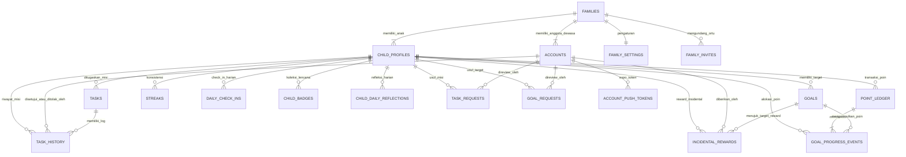
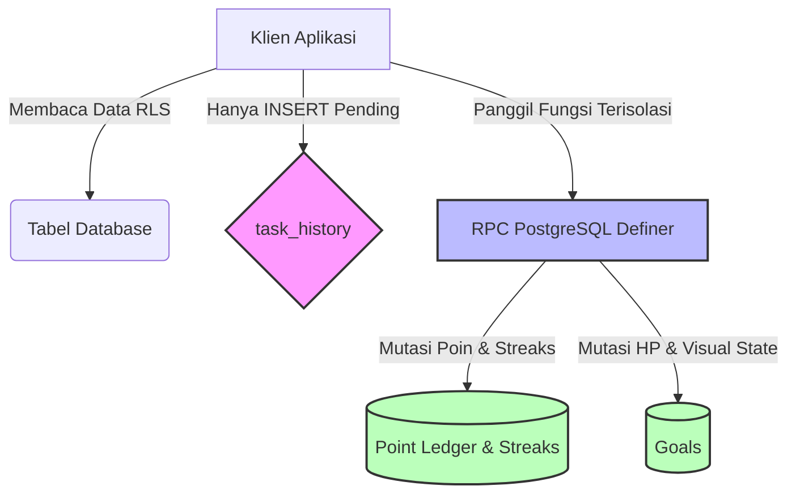

# Arsitektur Database & Skema Fisik — Habiku

Dokumen ini menyajikan rancangan **Arsitektur Database Fisik (Physical Database Schema)** secara mendalam dan komprehensif untuk **Habiku** — aplikasi pembentukan karakter anak (habit-tracker) berbasis **React Native + Expo + Supabase (PostgreSQL)**. 

Blueprints ini mencakup rincian tipe data PostgreSQL, constraints, indexing, Row Level Security (RLS) policies, Storage Buckets, Database Triggers, serta Remote Procedure Calls (RPC) transaksional yang telah diimplementasikan dalam migrasi Supabase.

---

## 1. Arsitektur Umum & Filosofi Database

Sistem database Habiku dirancang menggunakan PostgreSQL 15+ yang dihosting di Supabase dengan filosofi desain berikut:
1. **Keamanan Maksimal di Sisi Server (Security by Default)**: Menghindari mutasi data langsung dari client-side untuk operasi krusial. Client-side dibatasi hanya untuk membaca (SELECT) dan menulis pengajuan (INSERT pending). Seluruh operasi pemutasi state yang melibatkan poin, streak, HP target, dan visual state wajib menggunakan **RPC Security Definer** yang berjalan atomik di database level.
2. **Row Level Security (RLS) yang Optimal & Bebas Rekursi**: RLS diaktifkan di seluruh tabel publik. Untuk menghindari *infinite recursion* pada subquery policy, database menggunakan fungsi helper berkinerja tinggi `current_family_id()` dan `current_account_role()` dengan hak akses `SECURITY DEFINER` (bypass RLS oleh owner).
3. **Integritas Referensial**: Memanfaatkan cascading deletes (`ON DELETE CASCADE`) untuk merapikan data terkait ketika profil anak atau keluarga dihapus, namun menggunakan `ON DELETE SET NULL` atau `ON DELETE RESTRICT` pada tabel transaksional (seperti ledger) untuk menjaga audit log keuangan poin tetap utuh.
4. **Timezone-Awareness**: Waktu simpan di database menggunakan format UTC (`timestamptz`). Namun, penghitungan pencapaian harian anak (check-in harian, deadline target, missed task, dll) dikonversi secara dinamis mengikuti kolom `families.timezone` untuk memastikan konsistensi kalender harian anak di mana pun mereka berada.

---

## 2. Diagram Hubungan Entitas (ERD)

Database Habiku terbagi menjadi 3 lapisan logis utama yang saling terintegrasi:

---

## 3. Tipe Data Kustom (Custom Enums)

PostgreSQL Enums digunakan untuk menjaga integritas data domain dan mempermudah validasi:

### `public.account_role`
Menentukan hak akses akun dewasa dalam keluarga.
- `primary_parent`: Ortu utama (pembuat keluarga, pengelola tagihan/anggota).
- `secondary_parent`: Ortu pendamping (bisa menyetujui misi, tetapi tidak dapat menghapus keluarga/undangan).

### `public.goal_status`
Status pencapaian target/hadiah anak.
- `active`: Sedang berlangsung (hanya boleh ada 1 active goal per anak pada saat yang sama).
- `completed`: Selesai tercapai (HP terkumpul penuh).
- `archived`: Diarsipkan (tidak aktif).

### `public.frequency_type`
Jenis perulangan misi harian anak.
- `daily`: Setiap hari.
- `weekly`: Mingguan.
- `custom`: Berdasarkan konfigurasi khusus (mis. hari-hari tertentu).

### `public.task_category`
Kategori misi yang terhubung dengan Streaks.
- `ibadah`, `belajar`, `kebersihan`, `olahraga`, `lainnya`.

### `public.ledger_type`
Sumber aliran poin (energi) anak.
- `earn`: Poin dari penyelesaian misi/reward insidental (+).
- `spend`: Poin dialokasikan ke target aktif (-).
- `adjustment`: Penyesuaian poin manual oleh orang tua (+/-).
- `bonus_checkin`: Bonus check-in harian anak (+).
- `mystery_bonus`: Poin bonus dari mystery reward (opsional, P1).

### `public.task_history_status`
Status verifikasi pengajuan misi anak.
- `pending`: Menunggu persetujuan orang tua.
- `approved`: Disetujui (poin cair).
- `rejected`: Ditolak (poin hangus, perlu perbaikan).
- `missed`: Terlewat/tidak dikerjakan sampai tenggat waktu berakhir (poin nol, streak reset).

### `public.notification_recipient_type`
- `account`: Ditujukan kepada akun orang tua (ortu).
- `profile`: Ditujukan kepada profil anak.

### `public.goal_request_status` / `public.reflection_mood`
- **Reflection Mood**: `sangat_senang`, `senang`, `biasa`, `kurang_senang`.
- **Request Status**: `pending`, `approved`, `rejected`.

---

## 4. Kamus Data & Skema Tabel Fisik

Setiap tabel di bawah ini diimplementasikan di skema `public` dan memiliki RLS diaktifkan secara ketat.

### 4.1. Tabel `families`
Mewakili satu entitas keluarga. Merupakan root dari seluruh data relasional.

| Nama Kolom | Tipe Data | Nullable? | Default | Keterangan / Constraints |
| :--- | :--- | :--- | :--- | :--- |
| `id` | `uuid` | NO | `gen_random_uuid()` | PK |
| `name` | `text` | NO | `'Keluarga'` | Nama keluarga/paguyuban. |
| `timezone` | `text` | NO | `'Asia/Jakarta'` | Menentukan batasan hari kalender lokal untuk sistem harian anak. |
| `created_at` | `timestamptz` | NO | `now()` | Audit log waktu pembuatan. |

#### Indeks & RLS
- **RLS Policies**:
  - `families_select_member`: Memperbolehkan SELECT hanya untuk pengguna terautentikasi yang kolom `accounts.family_id`-nya sama dengan `families.id` (`id = public.current_family_id()`).
  - `families_update_parent`: Memperbolehkan UPDATE hanya untuk ortu (`public.current_account_role() in ('primary_parent', 'secondary_parent')` pada keluarga yang sama).
- **Mutasi langsung**: INSERT dibatasi (hanya bisa dibuat via bootstrap RPC). DELETE tidak diizinkan langsung dari client.

---

### 4.2. Tabel `accounts`
Akun orang tua yang terikat secara 1:1 dengan Supabase Auth `auth.users`.

| Nama Kolom | Tipe Data | Nullable? | Default | Keterangan / Constraints |
| :--- | :--- | :--- | :--- | :--- |
| `id` | `uuid` | NO | - | PK, FK referensi ke `auth.users.id` ON DELETE CASCADE |
| `family_id` | `uuid` | NO | - | FK referensi ke `public.families.id` ON DELETE CASCADE |
| `role` | `public.account_role` | NO | - | Peran ortu (`primary_parent` / `secondary_parent`). |
| `display_name` | `text` | YES | - | Nama panggilan ortu di aplikasi. |
| `created_at` | `timestamptz` | NO | `now()` | - |
| `updated_at` | `timestamptz` | NO | `now()` | - |

#### Indeks & RLS
- **Indeks**: `accounts_family_id_idx` pada `(family_id)`.
- **RLS Policies**:
  - `accounts_select_family`: Memperbolehkan SELECT jika `id = auth.uid()` atau `family_id = public.current_family_id()`.
  - `accounts_update_self`: Memperbolehkan UPDATE baris miliknya sendiri (`id = auth.uid()`) dengan syarat `family_id` tidak dimutasi lintas keluarga.

---

### 4.3. Tabel `child_profiles`
Profil anak-anak yang berada di bawah pengawasan keluarga tertentu.

| Nama Kolom | Tipe Data | Nullable? | Default | Keterangan / Constraints |
| :--- | :--- | :--- | :--- | :--- |
| `id` | `uuid` | NO | `gen_random_uuid()` | PK |
| `family_id` | `uuid` | NO | - | FK referensi ke `public.families.id` ON DELETE CASCADE |
| `name` | `text` | NO | - | Nama anak. |
| `pin_hash` | `text` | NO | - | Hash PIN masuk (di-hash menggunakan `crypt` + `blowfish` bcrypt). |
| `avatar_url` | `text` | YES | - | Path internal ke berkas di Storage privat `child-avatars`. |
| `avatar_preference` | `text` | NO | `'emoji'` | Preferensi visual anak: `'emoji'` atau `'photo'`. |
| `date_of_birth` | `date` | YES | - | Tanggal lahir anak (untuk gamifikasi/insight usia). |
| `gender` | `text` | YES | - | Jenis kelamin anak: `'L'` / `'P'`. |
| `home_card_accent` | `text` | NO | `'#8B5CF6'` | Aksen warna tema kartu beranda anak di UI. |
| `featured_task_id` | `uuid` | YES | - | FK referensi ke `public.tasks.id` ON DELETE SET NULL (Misi sorotan harian terpilih). |
| `attr_discipline` | `int` | NO | `0` | Nilai atribut karakter Disiplin (P1). |
| `attr_responsibility`| `int` | NO | `0` | Nilai atribut karakter Tanggung Jawab (P1). |
| `attr_independence`| `int` | NO | `0` | Nilai atribut karakter Kemandirian (P1). |
| `attr_care` | `int` | NO | `0` | Nilai atribut karakter Kepedulian (P1). |
| `attr_honesty` | `int` | NO | `0` | Nilai atribut karakter Kejujuran (P1). |
| `created_at` | `timestamptz` | NO | `now()` | - |
| `updated_at` | `timestamptz` | NO | `now()` | - |

#### Indeks & RLS
- **Indeks**: `child_profiles_family_id_idx` pada `(family_id)`, `child_profiles_featured_task_id_idx` pada `(featured_task_id)` WHERE `featured_task_id IS NOT NULL`.
- **RLS Policies**:
  - `child_profiles_select_family`: Memperbolehkan SELECT jika `family_id = public.current_family_id()`.
  - **INSERT/UPDATE langsung dari klien dinonaktifkan** (seluruh manipulasi dilakukan secara terkontrol via RPC `create_child_profile` dan `update_child_profile` demi menjaga validitas hashing PIN).

---

### 4.4. Tabel `goals`
Target hadiah atau pencapaian yang ingin dicapai oleh anak dengan mengumpulkan poin (HP).

| Nama Kolom | Tipe Data | Nullable? | Default | Keterangan / Constraints |
| :--- | :--- | :--- | :--- | :--- |
| `id` | `uuid` | NO | `gen_random_uuid()` | PK |
| `profile_id` | `uuid` | NO | - | FK referensi ke `public.child_profiles.id` ON DELETE CASCADE |
| `title` | `text` | NO | - | Nama hadiah/target (mis. "Sepeda Baru"). |
| `image_url` | `text` | YES | - | Path internal ke berkas di Storage privat `goal-images`. |
| `target_hp` | `int` | NO | - | Jumlah poin yang dibutuhkan untuk menebus hadiah (`target_hp > 0`). |
| `current_hp` | `int` | NO | `0` | Jumlah poin yang saat ini terkumpul (`current_hp >= 0`). |
| `status` | `public.goal_status`| NO | `'active'` | Status: `active` / `completed` / `archived`. |
| `visual_state` | `text` | NO | `'fresh'` | Kondisi visual target (FSD): `'fresh'`, `'slightly_wilted'`, `'wilted'`, `'dormant'`. |
| `created_at` | `timestamptz` | NO | `now()` | - |
| `updated_at` | `timestamptz` | NO | `now()` | - |

#### Indeks & RLS
- **Indeks**: `goals_profile_id_idx` pada `(profile_id)`.
- **Indeks Unik MVP**: `goals_one_active_per_child` pada `(profile_id)` WHERE `(status = 'active')`. Ini menjamin satu anak hanya memiliki **maksimal satu target aktif** pada satu waktu.
- **RLS Policies**:
  - `goals_select_family`: Memperbolehkan SELECT hanya jika profil anak terikat dengan keluarga pembaca.
  - `goals_insert_parent` / `goals_update_parent` / `goals_delete_parent`: CRUD hanya diizinkan untuk ortu di keluarga yang sama.

---

### 4.5. Tabel `tasks`
Definisi misi/tugas rutin yang harus diselesaikan oleh anak.

| Nama Kolom | Tipe Data | Nullable? | Default | Keterangan / Constraints |
| :--- | :--- | :--- | :--- | :--- |
| `id` | `uuid` | NO | `gen_random_uuid()` | PK |
| `profile_id` | `uuid` | NO | - | FK referensi ke `public.child_profiles.id` ON DELETE CASCADE |
| `title` | `text` | NO | - | Nama misi (mis. "Merapikan Kasur"). |
| `category` | `public.task_category`| NO | `'lainnya'` | Kategori tugas untuk visualisasi/streaks. |
| `reward_points` | `int` | NO | - | Reward poin/energi saat misi disetujui (`reward_points > 0`). |
| `frequency_type`| `public.frequency_type`| NO | `'daily'` | Frekuensi misi: `daily`, `weekly`, `custom`. |
| `frequency_config`| `jsonb` | NO | `'{}'` | Konfigurasi tambahan untuk custom frequency (mis. nama hari). |
| `max_submissions_per_period` | `int` | NO | `1` | Batasan maksimum penyelesaian misi per periode berjalan (`>= 1`). |
| `linked_attribute`| `text` | YES | - | Karakter atribut yang didapat anak saat sukses (P1). |
| `is_active` | `boolean` | NO | `true` | Apakah misi aktif ditampilkan di list anak. |
| `created_at` | `timestamptz` | NO | `now()` | - |
| `updated_at` | `timestamptz` | NO | `now()` | - |

#### Indeks & RLS
- **Indeks**: `tasks_profile_id_idx` pada `(profile_id)`.
- **RLS Policies**:
  - `tasks_select_family`: SELECT diizinkan bagi semua anggota keluarga.
  - `tasks_insert_parent` / `tasks_update_parent` / `tasks_delete_parent`: Mutasi CRUD hanya diizinkan untuk peran akun ortu di keluarga terkait.

---

### 4.6. Tabel `task_history`
Audit log dan riwayat pengajuan penyelesaian misi oleh anak serta persetujuan orang tua.

| Nama Kolom | Tipe Data | Nullable? | Default | Keterangan / Constraints |
| :--- | :--- | :--- | :--- | :--- |
| `id` | `uuid` | NO | `gen_random_uuid()` | PK |
| `task_id` | `uuid` | NO | - | FK referensi ke `public.tasks.id` ON DELETE CASCADE |
| `profile_id` | `uuid` | NO | - | FK referensi ke `public.child_profiles.id` ON DELETE CASCADE |
| `status` | `public.task_history_status`| NO | `'pending'` | Status pengajuan. |
| `evidence_url` | `text` | YES | - | Path internal ke berkas bukti di Storage privat `task-evidence`. |
| `notes` | `text` | YES | - | Catatan dari anak (saat submit) atau keterangan sistem (saat missed). |
| `completed_at` | `timestamptz` | NO | `now()` | Waktu anak menandai selesai di aplikasi. |
| `period_date` | `date` | YES | - | Tanggal kalender periode berjalan (TZ keluarga). Mencegah submit ganda per hari. |
| `approved_at` | `timestamptz` | YES | - | Waktu ortu memberikan persetujuan. |
| `approved_by_account_id` | `uuid` | YES | - | FK referensi ke `public.accounts.id` ON DELETE SET NULL |
| `rejected_at` | `timestamptz` | YES | - | Waktu ortu menolak pengajuan. |
| `rejected_by_account_id` | `uuid` | YES | - | FK referensi ke `public.accounts.id` ON DELETE SET NULL |
| `rejection_reason` | `text` | YES | - | Alasan penolakan dari ortu. |
| `missed_at` | `timestamptz` | YES | - | Waktu sistem menandai misi terlewat/missed. |
| `created_at` | `timestamptz` | NO | `now()` | - |

#### Indeks & RLS
- **Indeks**: `task_history_task_id_idx` pada `(task_id)`, `task_history_profile_id_idx` pada `(profile_id)`.
- **Antrean Review Ortu**: `task_history_pending_parent_queue_idx` parsial pada `(profile_id, status, created_at)` WHERE `(status = 'pending')` untuk mempercepat render dashboard antrean review orang tua.
- **Batasan Unik Periode Missed**: `task_history_missed_task_period_uidx` unik pada `(task_id, period_date)` WHERE `(status = 'missed')` untuk mencegah penandaan missed ganda pada misi yang sama pada hari yang sama.
- **RLS Policies**:
  - `task_history_select_family`: SELECT diperbolehkan bagi seluruh anggota keluarga.
  - `task_history_insert_family`: Klien terautentikasi dapat membuat (INSERT) riwayat baru dengan syarat **wajib status 'pending'** dan `profile_id` serta `task_id` valid di dalam keluarga pengirim.
  - **UPDATE dan DELETE diblokir total untuk client**. Approval / Rejection diproses eksklusif via RPC database.

---

### 4.7. Tabel `point_ledger`
Buku besar transaksi poin anak. Sumber tunggal saldo dan alokasi energi anak.

| Nama Kolom | Tipe Data | Nullable? | Default | Keterangan / Constraints |
| :--- | :--- | :--- | :--- | :--- |
| `id` | `uuid` | NO | `gen_random_uuid()` | PK |
| `profile_id` | `uuid` | NO | - | FK referensi ke `public.child_profiles.id` ON DELETE CASCADE |
| `account_id` | `uuid` | YES | - | FK referensi ke `public.accounts.id` (Aktor yang menyetujui/memberikan poin). |
| `amount` | `int` | NO | - | Nilai mutasi poin (+/-). |
| `type` | `public.ledger_type`| NO | - | Sumber transaksi (earn, spend, bonus_checkin, dll). |
| `task_history_id`| `uuid` | YES | - | FK referensi ke `public.task_history.id` ON DELETE SET NULL |
| `created_at` | `timestamptz` | NO | `now()` | - |

#### Indeks & RLS
- **Indeks**: `point_ledger_profile_id_idx` pada `(profile_id)`.
- **Indeks Unik Audit**: `point_ledger_one_earn_per_task_history_uidx` unik parsial pada `(task_history_id)` WHERE `(type = 'earn' AND task_history_id IS NOT NULL)`. Ini menjamin **satu bukti misi approved hanya bisa menghasilkan satu kali klaim poin** (mencegah *double-spending* atau *double-earning* akibat latensi jaringan).
- **RLS Policies**: SELECT diizinkan bagi sekeluarga. **Tulis langsung (INSERT/UPDATE/DELETE) ditutup 100% dari client**. Hanya server-side RPC yang dapat menulis baris di tabel ini.

---

### 4.8. Tabel `goal_progress_events`
Log pendanaan/alokasi poin dari ledger menuju target hadiah aktif milik anak.

| Nama Kolom | Tipe Data | Nullable? | Default | Keterangan / Constraints |
| :--- | :--- | :--- | :--- | :--- |
| `id` | `uuid` | NO | `gen_random_uuid()` | PK |
| `profile_id` | `uuid` | NO | - | FK referensi ke `public.child_profiles.id` ON DELETE CASCADE |
| `goal_id` | `uuid` | NO | - | FK referensi ke `public.goals.id` ON DELETE CASCADE |
| `ledger_id` | `uuid` | NO | - | FK referensi ke `public.point_ledger.id` ON DELETE RESTRICT |
| `amount` | `int` | NO | - | Nilai alokasi poin (`amount > 0`). |
| `created_at` | `timestamptz` | NO | `now()` | - |

#### Indeks & RLS
- **Indeks**: `goal_progress_events_profile_id_idx`, `goal_progress_events_goal_id_idx`.
- **RLS Policies**: SELECT diizinkan sekeluarga. Tulis langsung (INSERT/UPDATE/DELETE) ditutup dari client.

---

### 4.9. Tabel `streaks`
Menjaga rekor kebiasaan rutin berturut-turut anak per kategori tugas.

| Nama Kolom | Tipe Data | Nullable? | Default | Keterangan / Constraints |
| :--- | :--- | :--- | :--- | :--- |
| `id` | `uuid` | NO | `gen_random_uuid()` | PK |
| `profile_id` | `uuid` | NO | - | FK referensi ke `public.child_profiles.id` ON DELETE CASCADE |
| `task_category` | `public.task_category`| NO | - | Kategori tugas streak. |
| `current_streak`| `int` | NO | `0` | Jumlah rekor beruntun saat ini. |
| `best_streak` | `int` | NO | `0` | Rekor terbaik sepanjang masa. |
| `last_completed_date` | `date` | YES | - | Tanggal kalender penyelesaian misi terakhir (TZ keluarga). |
| `is_recovery_active` | `boolean` | NO | `false` | Apakah status recovery aktif (fitur penyelamatan streak, P1). |
| `created_at` | `timestamptz` | NO | `now()` | - |
| `updated_at` | `timestamptz` | NO | `now()` | - |

#### Indeks & RLS
- **Indeks Unik**: `streaks_profile_id_task_category_key` unik pada `(profile_id, task_category)`. Menjamin satu anak hanya memiliki satu log rekor per kategori.
- **RLS Policies**: SELECT diizinkan sekeluarga. Tulis langsung ditutup dari client.

---

### 4.10. Tabel `notifications`
Pemberitahuan in-app terintegrasi untuk orang tua dan anak, terhubung ke realtime publication.

| Nama Kolom | Tipe Data | Nullable? | Default | Keterangan / Constraints |
| :--- | :--- | :--- | :--- | :--- |
| `id` | `uuid` | NO | `gen_random_uuid()` | PK |
| `recipient_id` | `uuid` | NO | - | PK referensi penerima (bisa `accounts.id` atau `child_profiles.id`). |
| `recipient_type`| `public.notification_recipient_type`| NO | - | Kategori penerima: `account` / `profile`. |
| `type` | `text` | NO | - | Jenis notifikasi (mis. `task_pending_review`, `task_approved`, `task_rejected`, `goal_request_pending`). |
| `content` | `text` | NO | - | Isi pesan motivasi/pemberitahuan. |
| `is_read` | `boolean` | NO | `false` | Status baca. |
| `created_at` | `timestamptz` | NO | `now()` | - |

#### Indeks & RLS
- **Indeks**: `notifications_recipient_idx` pada `(recipient_type, recipient_id)`.
- **RLS Policies**:
  - `notifications_select_family`: SELECT diperbolehkan bagi ortu jika penerima adalah akun mereka atau profil anak sekeluarga.
  - `notifications_update_read_own`: UPDATE status `is_read` hanya diperbolehkan bagi pemilik notifikasi itu sendiri.
- **Supabase Realtime**: Terdaftar dalam publication `supabase_realtime` untuk pemutakhiran UI instan (tanpa polling) ketika ortu mendapat tugas review atau anak mendapat persetujuan misi.

---

### 4.11. Tabel Lain-Lain & Fitur Engagement

Untuk melengkapi gambaran database, tabel-tabel di bawah ini menangani fitur gamifikasi, relasi sosial, pengaturan lanjutan, dan engagement:

#### Tabel `family_invites`
Pemberian token undangan untuk akun `secondary_parent` baru bergabung.
- `id` (`uuid` PK), `family_id` (`uuid` FK), `token` (`text` unik default hex), `expires_at` (`timestamptz` default 14 hari), `created_by` (`uuid` FK), `consumed_at` (`timestamptz`).
- **RLS**: Mutasi hanya via RPC `create_family_invite()` dan `accept_family_invite()`.

#### Tabel `account_push_tokens`
Menyimpan token push Expo untuk notifikasi push perangkat fisik orang tua.
- `account_id` (`uuid` PK referensi `accounts`), `expo_push_token` (`text`), `platform` (`text`), `updated_at` (`timestamptz`).
- **RLS**: Pemilik akun dapat membaca dan melakukan UPSERT (`account_push_tokens_upsert_own`).

#### Tabel `family_settings`
Pengaturan gamifikasi dan engagement 1:1 per keluarga.
- `family_id` (`uuid` PK referensi `families`), `micro_anim_enabled` (`boolean` default true), `featured_multiplier` (`text` default '2x'), `daily_tip_enabled` (`boolean` default true), `show_sibling_highlight` (`boolean` default false), `check_in_reminder_enabled` (`boolean` default true), `family_garden_enabled` (`boolean` default true), `daily_check_in_bonus` (`int` default 2), `updated_at` (`timestamptz`), `updated_by` (`uuid` FK).
- **RLS**: SELECT & UPDATE hanya untuk ortu di keluarga tersebut. Baris baru di-insert otomatis via database trigger saat keluarga di-bootstrap.

#### Tabel `daily_check_ins`
Idempotent harian bonus energi masuk aplikasi anak.
- `id` (`uuid` PK), `profile_id` (`uuid` FK), `check_in_date` (`date` unik per profil), `bonus_awarded` (`int` 1..10), `ledger_id` (`uuid` FK).
- **RLS**: SELECT diizinkan sekeluarga, INSERT/UPDATE dibatasi hanya melalui RPC `award_daily_checkin_bonus()`.

#### Tabel `child_badges`
Koleksi lencana permanen pencapaian karakter anak.
- `id` (`uuid` PK), `profile_id` (`uuid` FK), `badge_key` (`text` unik per anak: `first_steps`, `mission_5`, `mission_25`, `streak_3_any`, `streak_7_any`, `goal_first`, `goal_3`, `check_in_7`, `bonus_featured`), `awarded_at` (`timestamptz`).
- **RLS**: SELECT diizinkan sekeluarga. INSERT dikelola otomatis oleh trigger database pasca-approval.

#### Tabel `learning_tips`
Koleksi tips mendidik harian "Tahukah Kamu" per keluarga.
- `id` (`uuid` PK), `family_id` (`uuid` FK), `emoji` (`text`), `title` (`text`), `body` (`text` max 400 kar), `is_active` (`boolean` default true), `weight` (`smallint` 1..5), `created_by` (`uuid` FK).
- **RLS**: Ortu mengelola CRUD secara penuh, anak hanya dapat membaca (SELECT) melalui RPC deterministik `pick_daily_tip()`.

#### Tabel `child_daily_reflections`
Formulir refleksi sore harian anak (mood & catatan harian).
- `id` (`uuid` PK), `profile_id` (`uuid` FK), `reflection_date` (`date` unik per anak), `mood` (`public.reflection_mood`), `note` (`text` max 280 kar).
- **RLS**: SELECT sekeluarga. Mutasi hanya via RPC `submit_child_reflection()`.

#### Tabel `incidental_rewards`
Audit log pemberian apresiasi kilat sekali jalan oleh orang tua (di luar rutinitas harian).
- `id` (`uuid` PK), `profile_id` (`uuid` FK), `granted_by_account_id` (`uuid` FK), `title` (`text` max 80 kar), `note` (`text` max 200 kar), `category` (`task_category`), `hp_to_target` (`int` 0..50), `energy_only` (`int` 0..50), `goal_id` (`uuid` FK), `hp_ledger_id` (`uuid` FK), `energy_ledger_id` (`uuid` FK).
- **RLS**: SELECT sekeluarga. Pengisian poin aman via RPC `give_incidental_reward()`.

#### Tabel `goal_requests` / `task_requests`
Pengajuan target/ide misi dari mode anak untuk ditinjau orang tua.
- **RLS**: SELECT sekeluarga. Anak dapat mengajukan (INSERT pending), orang tua meninjau dan memicu RPC `approve_goal_request()` atau `approve_task_request()` untuk otomatis menutup permintaan dan menerbitkannya menjadi entri riil (`goals` / `tasks`).

#### Tabel `goal_hp_transfers`
Audit log perpindahan energi/HP antar dua target aktif milik seorang anak.
- `id` (`uuid` PK), `profile_id` (`uuid` FK), `from_goal_id` (`uuid` FK), `to_goal_id` (`uuid` FK), `amount` (`int` > 0), `initiated_by_account_id` (`uuid` FK), `note` (`text` max 200 kar).
- **RLS**: SELECT sekeluarga. Mutasi via RPC transaksional `transfer_goal_hp()`.

---

## 5. Triggers & Automations (Sisi Database)

Untuk mengurangi kompleksitas kode aplikasi klien, database PostgreSQL menangani automasi penting melalui trigger:

### 5.1. `families_ensure_family_settings`
- **Tabel Sumber**: `families` (AFTER INSERT)
- **Fungsi**: `ensure_family_settings_row()`
- **Tujuan**: Menjamin setiap kali keluarga baru terbentuk (baik via sign-up utama maupun bootstrap), satu baris pengaturan `family_settings` dengan konfigurasi default yang aman langsung terbit secara otomatis.

### 5.2. `family_settings_touch_updated`
- **Tabel Sumber**: `family_settings` (BEFORE UPDATE)
- **Fungsi**: `touch_family_settings_updated_at()`
- **Tujuan**: Mengisi kolom `updated_at` dengan waktu server `now()` terkini setiap kali baris konfigurasi diubah.

### 5.3. `trg_task_history_award_badges`
- **Tabel Sumber**: `task_history` (AFTER UPDATE OF status)
- **Fungsi**: `trigger_award_badges_on_approve()`
- **Tujuan**: Ketika orang tua menyetujui misi (`status` berubah menjadi `approved`), database secara otomatis mengevaluasi seluruh riwayat anak untuk membuka lencana/badge baru yang memenuhi syarat (best-effort, idempotent).

### 5.4. `trg_task_history_set_period_date`
- **Tabel Sumber**: `task_history` (BEFORE INSERT)
- **Fungsi**: `task_history_set_period_date_on_pending()`
- **Tujuan**: Mengonversi stamp `completed_at` (UTC) dari submit baru menjadi format `date` lokal keluarga sesuai kolom `families.timezone`. Nilai ini disimpan di `period_date` dan melayani pengecekan batas maksimum pengajuan.

### 5.5. `trg_task_requests_notify_parents` / `trg_goal_requests_notify_parents`
- **Tabel Sumber**: `task_requests` / `goal_requests` (AFTER INSERT)
- **Fungsi**: `notify_parents_on_task_request_pending()` / `notify_parents_on_goal_request_pending()`
- **Tujuan**: Mengirim notifikasi in-app instan ke seluruh akun orang tua di dalam keluarga ketika anak mengirimkan usulan target atau ide misi baru dari perangkat mereka.

### 5.6. `trg_task_history_notify_parents_pending`
- **Tabel Sumber**: `task_history` (AFTER INSERT)
- **Fungsi**: `notify_parents_on_child_task_pending()`
- **Tujuan**: Ketika anak mengirimkan penyelesaian misi (INSERT status `pending`), database otomatis menyisipkan notifikasi review ke dashboard orang tua sekeluarga.

### 5.7. `tasks_clear_featured_on_deactivate`
- **Tabel Sumber**: `tasks` (AFTER UPDATE OF is_active)
- **Fungsi**: `clear_featured_task_on_task_deactivate()`
- **Tujuan**: Jika orang tua menonaktifkan suatu misi (`is_active` berubah menjadi `false`), trigger ini secara otomatis menghapus tautan misi tersebut dari kolom `child_profiles.featured_task_id` agar multiplier tidak mengacu pada misi mati.

---

## 6. Remote Procedure Calls (RPC) Transaksional

RPC di bawah ini dijalankan dengan izin khusus `SECURITY DEFINER` (menjalankan query atas hak akses owner database) untuk mengisolasi logika mutasi penting secara aman dan atomik.

### 6.1. `approve_task_history(p_task_history_id uuid)`
*Inti dari aplikasi Habiku (Mesin Pembentuk Karakter).*
1. **Validasi**: Memverifikasi pemanggil adalah orang tua terdaftar di keluarga anak tersebut. Memastikan status riwayat masih `pending`.
2. **Pemberian Poin**: Menulis transaksi `earn` ke `point_ledger` sebesar nilai dasar `tasks.reward_points` (atau dikalikan multiplier jika misi tersebut disematkan sebagai misi sorotan).
3. **Alokasi Hadiah**: Jika anak memiliki `goals` aktif, database menghitung sisa HP target, lalu mencatat baris baru di `goal_progress_events` dan menambahkan HP langsung ke kolom `goals.current_hp`. Jika target HP terpenuhi, status goal otomatis bergeser menjadi `completed`.
4. **Streak**: Mengevaluasi streak harian anak untuk kategori tugas tersebut. Jika tanggal penyelesaian adalah hari ini atau kemarin, streak berlanjut (`current_streak + 1`). Jika melompati hari, streak di-reset kembali ke 1. `best_streak` diperbarui jika rekor terpecahkan.
5. **Notifikasi**: Menandai baris `task_history` menjadi `approved` dan menyisipkan notifikasi in-app keberhasilan ke perangkat anak.

### 6.2. `reject_task_history(p_task_history_id uuid, p_reason text)`
Menolak pengajuan anak. Mengubah status riwayat menjadi `rejected` dan mencatat alasan penolakan (`rejection_reason`). Tidak ada mutasi poin atau streak yang terjadi. Mengirimkan notifikasi alasan penolakan ke profil anak.

### 6.3. `give_incidental_reward(p_profile_id uuid, p_title text, p_note text, p_category task_category, p_hp_to_target int, p_energy_only int, p_goal_id uuid)`
Memungkinkan orang tua memberi poin apresiasi instan. Mendukung alokasi langsung ke HP target anak (lewat `goal_progress_events` + update goal) dan/atau dimasukkan ke saldo energi bebas umum anak.

### 6.4. `award_daily_checkin_bonus(p_profile_id uuid)`
*Idempotent Daily Check-in.*
1. Mengonversi waktu server saat ini ke tanggal lokal keluarga anak.
2. Memeriksa apakah anak sudah klaim hari ini via tabel `daily_check_ins`. Jika sudah, langsung mengembalikan status tanpa mutasi poin.
3. Jika belum, database menulis ledger `bonus_checkin` baru (nilai bonus dibaca dari `family_settings.daily_check_in_bonus` keluarga, default 2) dan menyisipkan baris di `daily_check_ins`.
4. Menghitung dan mengembalikan panjang rantai (chain length) check-in beruntun anak.

### 6.5. `transfer_goal_hp(p_profile_id uuid, p_from_goal_id uuid, p_to_goal_id uuid, p_amount int, p_note text)`
Memungkinkan alokasi ulang HP antar dua target aktif milik anak yang sama secara aman dalam satu transaksi PostgreSQL.
- Mengurangi `current_hp` pada goal asal dan menambahkan `current_hp` pada goal tujuan.
- Mengubah status goal tujuan ke `completed` bila HP target tercapai.
- Mencatat mutasi ke tabel audit `goal_hp_transfers`.

### 6.6. `mark_missed_tasks_tick()`
*Background Cron Scheduler.*
- Berfungsi untuk mendeteksi misi-misi aktif (`frequency_type` harian/kustom) yang tidak diselesaikan sama sekali oleh anak pada hari kalender kemarin (berdasarkan timezone keluarga masing-masing).
- Jika terdeteksi absen, database menyisipkan baris `task_history` baru berstatus `missed`, mereset `current_streak` kategori tersebut menjadi 0, dan memicu **visual degradation** pada target aktif anak:
  - 1 hari absen berturut-turut: Target layu sebagian (`slightly_wilted`).
  - 2+ hari absen berturut-turut: Target layu berat (`wilted`).
  - 5+ hari absen berturut-turut: Target tidur/mati suri (`dormant`).
- Mengirim notifikasi empati harian ke orang tua jika anak sudah 3 hari berturut-turut melewatkan misi yang sama untuk memicu diskusi ringan.

---

## 7. Konfigurasi Supabase Storage

Habiku menggunakan 3 Storage Buckets privat dengan enkripsi RLS pada metadata berkas objek:

### 7.1. Bucket `child-avatars`
- **Sifat**: Privat (tidak publik).
- **Struktur Path**: `<profile_id>/avatar.<ext>` (mis. `3ee21-bb21-.../avatar.png`).
- **RLS Policies**:
  - `child_avatars_select_family`: SELECT objek diizinkan jika bagian pertama path (`split_part(name, '/', 1)`) merujuk pada profil anak di keluarga pembaca.
  - `child_avatars_insert_family` / `update` / `delete`: Diizinkan bagi keluarga jika ID profil anak pada path cocok dengan relasi keluarga pembaca.

### 7.2. Bucket `goal-images`
- **Sifat**: Privat.
- **Struktur Path**: `<goal_id>/cover.<ext>` (mis. `921aa-8811-.../cover.jpg`).
- **RLS Policies**: SELECT/INSERT/UPDATE/DELETE diizinkan jika ID goal pada path merujuk pada target aktif milik profil anak yang berada di keluarga pengguna terautentikasi.

### 7.3. Bucket `task-evidence`
- **Sifat**: Privat.
- **Struktur Path**: `<task_id>/<unique_uuid>.webp`
- **RLS Policies**: Akses baca bukti foto penyelesaian dibatasi ketat hanya untuk anggota keluarga yang bersangkutan. INSERT diperbolehkan bagi anak dari keluarga tersebut untuk mengunggah foto saat mengajukan misi selesai.

---

## 8. Ringkasan Strategi Keamanan Database

Untuk memastikan integritas tinggi, arsitektur database menerapkan prinsip hardening berikut:

1. **Anti-Recursion RLS**: Subquery RLS yang langsung memanggil tabel `accounts` berulang kali akan memicu error stack PostgreSQL. Penggunaan helper inline `current_family_id()` memotong overhead latensi pemeriksaan keamanan hingga 90%.
2. **Double-Submission Guard**: Pemanfaatan indeks unik parsial pada `point_ledger` menjamin bahwa poin `earn` yang terikat pada `task_history_id` tidak dapat disisipkan ulang, mematikan potensi bug duplikasi saldo poin.
3. **Audit Trails**: Ledger poin (`point_ledger`) adalah tabel *append-only*. Database tidak memiliki fungsi update saldo secara langsung; setiap penambahan maupun pengurangan (pembelian hadiah) direkam sebagai entri baru yang terpisah demi transparansi penuh bagi orang tua dan anak.
