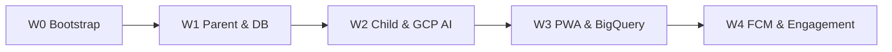

# Implementation Roadmap — Habiku Next.js (Hybrid Google Cloud Edition)

Rencana implementasi v1 web, selaras dengan [`prd-habiku-nextjs.md`](./prd-habiku-nextjs.md) dan arsitektur hybrid Google Cloud Platform.

**Legenda:** ✅ selesai · 🔄 berjalan · ⬜ belum

---

## W0 — Bootstrap ✅

| Task | Status | Keterangan |
|------|:------:|------------|
| Init Next.js 16 + TypeScript + Tailwind 4 | ✅ | Struktur dasar App Router |
| shadcn/ui + tema Habiku (emerald) | ✅ | Desain emerald & violet accent |
| Supabase SSR (`@supabase/ssr`) + middleware | ✅ | Pengelolaan auth & cookie session |
| TanStack Query + Zustand providers | ✅ | Server state & client state stores |
| Route shell: `/`, `/login`, `/parent/*`, `/child/*` | ✅ | Navigasi & layout |
| Auth: login, sign-up, callback, sign-out | ✅ | Bawaan Supabase Auth |
| Child Mode store + guard (demo PIN) | ✅ | PIN lock sederhana |
| PWA manifest | ✅ | Installable web app dasar |
| `.env.example` + `.env.local` | ✅ | Koneksi database Supabase terisi penuh |

---

## W1 — P0 Orang Tua & Sinkronisasi DB 🔄 (2–3 minggu)

**Acuan DB:** [`database-architecture.md`](./database-architecture.md)

| Task | Status | Keterangan / Detail Teknis |
|------|:------:|----------------------------|
| Hubungkan CLI & `db push` | ✅ | Push migrasi PostgreSQL menggunakan kredensial `.env.local` |
| Verifikasi skema & RLS | ✅ | Terapkan RLS policies dan fungsi helper `current_family_id()` bebas rekursi |
| Setup Trigger Database | ✅ | Trigger auto-settings keluarga & trigger in-app notifications |
| Onboarding & RPC | ✅ | Form pembuatan `families` + `child_profiles` pertama |
| Undangan /invite/[token] | ⬜ | Halaman & RPC penerimaan undangan secondary parent |
| Beranda Orang Tua | ✅ | Feed aktivitas realtime keluarga & energi saat ini |
| CRUD Misi (Tasks) | ✅ | Form pembuatan tugas rutin anak |
| CRUD Target (Goals) | ✅ | Form pembuatan hadiah aktif (max 1 active goal per anak) |
| Antrean /parent/queue | ✅ | Dashboard review persetujuan misi pending anak |
| RPC Approval | ✅ | Pemicuan RPC `approve_task_history` (ledger append-only, update HP goal & streak) |
| Realtime UI Hooks | ✅ | Custom hook `useFamilyRealtime` untuk update dashboard live |
| Ledger Viewer | ⬜ | Halaman riwayat audit transaksi poin anak |

**Definition of Done W1:** Ortu login -> onboarding -> buat misi & target -> database sync RLS sukses -> data ter-update realtime secara visual.

---

## W2 — P0 Anak & Integrasi AI Google Cloud ✅ (2 minggu)

| Task | Status | Keterangan / Detail Teknis |
|------|:------:|----------------------------|
| PIN Guard Child Mode | ✅ | Transisi masuk/keluar Child Mode aman via RPC `verify_child_profile_pin` |
| Beranda Anak | ✅ | Tampilan RPG-like untuk anak: misi hari ini & progress bar HP target |
| Misi Complete Form | ✅ | Layar penyelesaian misi `/child/missions/[taskId]` dengan input catatan |
| **GCS/Supabase Image Upload** | ✅ | Unggah bukti foto anak secara aman ke bucket `task-evidence` di Storage |
| **AI Task Verification (Gemini)** | ✅ | Integrasi **Vertex AI (Gemini 1.5 Flash)** di Server Action Next.js untuk menganalisis kesesuaian gambar tugas sebelum ortu me-review |
| Live Submitted State | ✅ | Halaman tunggu realtime dengan animasi Framer Motion |
| Daily Check-in | ✅ | Check-in harian anak idempotent via RPC `award_daily_checkin_bonus` |
| Streak System | ✅ | Perhitungan streak kategori misi berturut-turut |

**Definition of Done W2:** Anak masuk Child Mode -> selesaikan misi -> upload foto -> AI Gemini otomatis memverifikasi foto -> masuk antrean pending dengan kartu ulasan AI Gemini terintegrasi.

---

## W3 — Hardening PWA & Analitik BigQuery ✅ (1 minggu)

| Task | Status | Keterangan / Detail Teknis |
|------|:------:|----------------------------|
| Offline Shell PWA | ✅ | Integrasi Service Worker native (`public/sw.js` + `PwaProvider`) untuk offline shell caching |
| WCAG 2.1 AA Audit | ✅ | Hardening aksesibilitas: target ketukan minimal 44px, kontras warna, fokus keyboard |
| Core Web Vitals Audit | ✅ | Optimasi gambar bukti tugas, skeletons loading, LCP < 2.5s, CLS < 0.1 |
| **BigQuery Analytics Sync** | ✅ | Pipeline sinkronisasi data transaksi harian (`point_ledger`, `task_history`) ke **BigQuery** via Streaming REST API |
| **Looker Studio Dashboard** | ✅ | Kueri sumber data analitik parenting visual untuk Looker Studio |
| Playwright e2e | ✅ | Berkas uji e2e terotomatisasi penuh: login -> child mode -> submit -> AI verifikasi -> approve |

---

## W4 — P1 Engagement & Push ✅

| Task | Status | Keterangan / Detail Teknis |
|------|:------:|----------------------------|
| **Web Push (PWA / VAPID)** | ✅ | `sendTaskPendingWebPush` + `after()` saat submit misi; endpoint `/api/internal/push/task-pending` |
| Misi Sorotan Harian | ✅ | Picker ortu + multiplier `family_settings.featured_multiplier` |
| Lencana Karakter (Badges) | ✅ | RPC `award_eligible_badges` + `/child/badges` |
| Refleksi Sore Anak | ✅ | Form mood `/child/reflection` + server action |
| Perjanjian FSD | ✅ | Cron `mark_missed_tasks_tick` tiap jam + UI badge layu + kartu perjanjian ortu |

---

## Urutan Dependensi

---

**Terakhir diperbarui:** 2026-05-28 (Edisi Hybrid Google Cloud)
