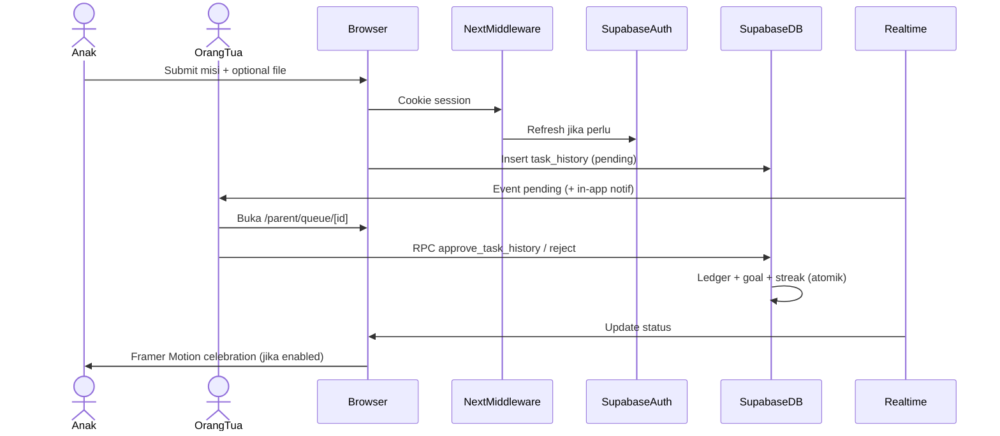

# PRD — Habiku (Next.js + Supabase)

Dokumen ini adalah **Product Requirements Document** resmi untuk **Habiku** pada stack **Next.js (App Router) + React + Supabase**. Produk, aturan bisnis, skema database, dan RPC **diwarisi** dari implementasi referensi React Native; dokumen ini mendefinisikan **bagaimana** persyaratan yang sama diimplementasikan di web.

**Dokumen terkait:**
- [`database-architecture.md`](./database-architecture.md) — **Skema fisik PostgreSQL** (tabel, RLS, RPC, Storage, triggers)
- [`prd-habiku-react.md`](./prd-habiku-react.md) — PRD referensi (React Native + Expo); domain produk
- [`implementation-roadmap-nextjs.md`](./implementation-roadmap-nextjs.md) — Rencana tahapan implementasi web (v1)
- [`fsd-punishment-habiku.md`](./fsd-punishment-habiku.md) — Sistem Konsekuensi & Perjanjian *(direncanakan; salin dari repo RN)*
- [`setup-wajib-v1-nextjs.md`](./setup-wajib-v1-nextjs.md) — Setup Supabase, env, Vercel, Web Push *(direncanakan)*

> **Status implementasi (workspace `habiku-nextjs`, 2026-05-28):** Semua centang di §3 dan status di §16 adalah **target produk**, bukan audit kode. Workspace ini berisi spesifikasi; implementasi dimulai dari nol. Setelah kode ada, centang `[x]` hanya boleh ditambahkan jika diverifikasi di repositori (lihat skill *verification-before-completion*).

---

## 1. Overview

### 1.1. Masalah

Sama dengan versi mobile: anak cenderung ke layar instan, kebiasaan baik sulit konsisten, orang tua butuh alat keluarga yang mendukung multi-orang tua, ledger poin yang andal, dan engagement yang membangun — tanpa framing hukuman.

### 1.2. Solusi

**Habiku (Web)** menghadirkan pengalaman produk yang **setara** dengan aplikasi mobile:

- Target visual interaktif (banyak goal per anak)
- Gameplay RPG ringan (Point Ledger → alokasi goal)
- Manajemen keluarga multi-orang tua
- **Child Mode** berbasis sesi browser (PIN orang tua)
- Gamifikasi: streak, daily quest, badge, check-in, misi sorotan, refleksi sore
- Konsekuensi berbasis kesepakatan (FSD)

**Perbedaan strategis web:** satu codebase **responsive + PWA** dapat diakses dari ponsel, tablet, dan desktop keluarga tanpa menunggu rilis store; cocok untuk iterasi cepat, undangan ortu via link, dan ortu yang lebih nyaman di layar besar.

### 1.3. Keputusan Stack

| Aspek | Keputusan |
|-------|-----------|
| **Framework** | **Next.js 15+** (App Router, React 19) |
| **Styling** | **Tailwind CSS v4** + komponen UI (shadcn/ui atau setara) |
| **Backend** | **Hybrid: Supabase** (PostgreSQL, Auth, Realtime, RLS) + **Google Cloud Platform** (Vertex AI, Google Cloud Storage, BigQuery) |
| **Auth di web** | `@supabase/ssr` — cookie httpOnly, middleware refresh sesi |
| **Data fetching** | TanStack Query v5 + Server Components untuk data read-only awal |
| **Deploy** | **Vercel** (preview per PR, production di domain Habiku) |
| **Instalasi** | **PWA** (manifest + service worker) — “Add to Home Screen” di iOS/Android |
| **Animasi** | Framer Motion + CSS; hormati `prefers-reduced-motion` |
| **Observability** | PostHog (web SDK), Sentry Next.js *(opsional P0)* |

**Satu aplikasi web** untuk orang tua dan anak; peran dipisahkan lewat route group `(parent)` / `(child)` dan guard Child Mode — bukan dua domain terpisah.

### 1.4. Model Bisnis

Gratis (Free-to-use); donasi komunitas di masa depan (gateway §7). Tidak ada paywall fitur inti v1.

### 1.5. Relasi dengan Versi React Native

| Layer | Strategi |
|-------|----------|
| **Database, RLS, RPC, Edge Functions** | **Reuse** — migrasi dari repo RN di-push ke proyek Supabase yang sama atau clone skema |
| **UI/UX & routing** | **Reimplement** — pola Next.js App Router, bukan port 1:1 file Expo |
| **Paritas fitur** | P0 web = subset P0 RN yang masuk akal di browser; lihat §3.4 |

---

## 2. Requirements

### 2.1. Fungsional

| # | Kebutuhan | Detail (Web) |
|---|-----------|--------------|
| F1 | **Aksesibilitas** | Satu **web app responsif** + **PWA**; target utama mobile browser (375px+), mendukung tablet/desktop ortu |
| F2 | **Manajemen Keluarga** | Primary & Secondary Parent; undangan via **URL** (`/invite/[token]`) |
| F3 | **Profil Anak** | CRUD profil, avatar, PIN child lock, DOB, gender |
| F4 | **Banyak Target (Goal)** | ≥1 goal aktif per anak; agregat HP di UI |
| F5 | **Daily Quests** | Frekuensi, `max_submissions_per_period`, timezone keluarga |
| F6 | **Parental Approval** | Approve/Reject + alasan + audit |
| F7 | **Point Ledger** | `earn`, `spend`, `adjustment`, `bonus_checkin` |
| F8 | **Goal Progress** | `goal_progress_events` |
| F9 | **Streak** | Per kategori + full daily mission streak |
| F10 | **Child Mode** | Sesi anak di browser; keluar/ganti profil = PIN ortu (RPC `verify_child_profile_pin`) |
| F11 | **Bukti Misi** | Upload foto via `<input type="file" capture>` / drag-drop → Google Cloud Storage (GCS) + verifikasi otomatis via **Vertex AI (Gemini 1.5 Flash)** |
| F12 | **Notifikasi** | **In-app** wajib P0; **Web Push** P0+ berbasis browser token menggunakan **Firebase Cloud Messaging (FCM)** |
| F13 | **Misi Insidental** | `give_incidental_reward` |
| F14 | **Engagement Beranda Anak** | Check-in, sorotan, badge, tips, refleksi, kebun energi |
| F15 | **Validasi Tugas** | Konfirmasi manual ortu |

### 2.2. Non-Fungsional

| # | Kebutuhan | Detail (Web) |
|---|-----------|--------------|
| NF1 | **Mobile-first responsive** | Layout fluid, touch target ≥44px, safe area via `env(safe-area-inset-*)` |
| NF2 | **Animasi performa** | Animasi ringan di compositor; hindari layout thrashing; Lottie via `lottie-react` jika perlu |
| NF3 | **Cache & offline** | TanStack Query SWR; PWA cache shell + asset statis; **bukan** offline penuh v1 |
| NF4 | **Keamanan** | RLS + RPC; anon key di client; **service role hanya** di Route Handlers / Edge |
| NF5 | **Integritas Data** | Sama RN — semua poin lewat Ledger |
| NF6 | **SEO & sharing** | Halaman marketing/login boleh di-index; area `(parent)`/`(child)` **noindex** |
| NF7 | **Core Web Vitals** | LCP < 2.5s (4G), CLS < 0.1 pada beranda anak (target produk) |
| NF8 | **A11y** | WCAG 2.1 AA untuk alur P0 (fokus keyboard, label form, kontras) |

### 2.3. Perbedaan Fungsional vs React Native (eksplisit)

| Fitur | RN | Next.js v1 |
|-------|-----|------------|
| Push FCM native | ✅ Expo Notifications | ⏳ Web Push (P0+); in-app P0 |
| Kamera native | Image Picker | File input + `capture` |
| Haptics | Expo Haptics | Tidak (opsional vibrasi API terbatas) |
| Deep link universal | Expo linking | Next.js routes + PWA start_url |
| App Store / EAS | ✅ | Tidak — distribusi via URL + PWA |
| Background fetch | Terbatas | Service worker terbatas; andalkan Realtime saat tab aktif |

---

## 3. Core Features & Prioritization

Status default: **`[ ]` belum** — diisi setelah verifikasi kode di repo ini.

### P0 — Fondasi inti (paritas wajib web v1)

- [ ] **Auth & keluarga** — email/password + Google OAuth (Supabase Auth)
- [ ] **Onboarding** — buat keluarga + profil anak pertama
- [ ] **Undangan Secondary Parent** — `/invite/[token]`
- [ ] **Dashboard ortu** — tabs: Beranda, Misi, Target, Profil Anak
- [ ] **CRUD task & goal** — termasuk gambar goal, evidence upload
- [ ] **Antrean approval** — approve/reject + audit
- [ ] **Point Ledger viewer** — ortu
- [ ] **Child Mode + PIN** — masuk/keluar sesi anak
- [ ] **Beranda anak** — misi, target, submit + bukti
- [ ] **Realtime** — status pending → approved live
- [ ] **Daily check-in chain** — RPC `award_daily_checkin_bonus`
- [ ] **Streak dasar** — per kategori + full daily mission
- [ ] **In-app notifications** — ortu & anak
- [ ] **Missed task job** — Edge `mark-missed-tick` + timezone keluarga
- [ ] **PWA manifest** — installable, ikon, theme color
- [ ] **Middleware auth** — proteksi route group

### P1 — Pelengkap (setelah P0 stabil)

- [ ] **Web Push** — subscribe ortu, trigger dari Edge Functions
- [ ] **Misi sorotan harian** — `compute_featured_task`
- [ ] **Sticky note ortu + terima kasih**
- [ ] **Badge, tips edukatif, sorotan saudara**
- [ ] **Misi insidental, goal countdown, animasi mikro** (Framer Motion + toggle)
- [ ] **Perjanjian konsekuensi (FSD)** — setelah migrasi 10.A
- [ ] **Tabungan digital, Weekly Boss, Skill Tree, Mystery, Recovery, Co-op** — sama roadmap RN §18

### P2 — Roadmap jangka panjang

- [x] **Kebun energi, refleksi sore** — W4 refleksi; kebun W5
- [ ] **Usul misi** — paritas RN P2
- [ ] **Family Challenges, Community/Forum, donasi in-app**

### 3.4. Matriks paritas RN → Web (P0)

| Fitur RN (sudah di PRD RN) | Target web v1 |
|----------------------------|---------------|
| Semua P0 RN §3 | **Ya** — kecuali push native & haptics |
| Rilis EAS / store | **Tidak berlaku** — diganti deploy Vercel + PWA |
| OTA Expo Updates | **Tidak** — deploy web instan |

---

## 4. User Flow

### 4.1. Alur Orang Tua

```
┌─────────────┐     ┌──────────────┐     ┌───────────────────┐
│  / (landing) │────▶│ /login       │────▶│  /onboarding      │
│  atau /login │     │ /sign-up     │     │  keluarga + anak  │
└─────────────┘     └──────────────┘     └───────┬───────────┘
                                                  ▼
                    ┌──────────────────────────────────────────┐
                    │     /parent (layout + bottom nav)      │
                    ├──────────┬──────────┬──────────┬───────┤
                    │ Beranda  │  Misi    │  Target  │ Profil│
                    └────┬─────┴────┬─────┴────┬─────┴───┬───┘
                         │          │          │         │
                         ▼          ▼          ▼         ▼
                    /parent/queue  tasks    goals    child CRUD
                    approve/reject CRUD     CRUD     → Child Mode
```

### 4.2. Alur Anak (Child Mode)

```
/parent/profil-anak → pilih anak → verifikasi PIN
        │
        ▼
/child (layout terkunci) → /child/home
        │
        ├── selesai misi → /child/complete/[taskId]
        ├── menunggu     → /child/submitted
        └── keluar       → PIN sheet → kembali /parent
```

### 4.3. Siklus Utama (Sequence)



---

## 5. Architecture

### 5.1. Prinsip

- **Backend tetap Supabase** — tidak menduplikasi logika bisnis di Next API kecuali untuk secret (web push, webhook)
- **RLS + RPC** tetap garis pertahanan; Route Handlers hanya untuk operasi yang butuh service role atau VAPID private key
- **Server Components** untuk data read awal (dashboard ortu ringkas); mutasi & Realtime di Client Components
- **Satu domain** — Child Mode = state klien + route guard, bukan subdomain terpisah

### 5.2. Pola Engineering

| Aspek | Pola | Detail |
|-------|------|--------|
| **Routing** | App Router | Groups: `(marketing)`, `(auth)`, `parent`, `child` |
| **Auth** | `@supabase/ssr` | `createServerClient` + `createBrowserClient`; middleware refresh |
| **Server state** | TanStack Query | Provider di `app/providers.tsx`; prefetch di RSC opsional |
| **Client state** | Zustand + `localStorage` | `activeChildProfileId`, `childMode`, `familySettings` cache |
| **Form** | React Hook Form + Zod | Sama RN |
| **File upload** | Client → Storage signed URL | Kompresi client-side (canvas) sebelum upload |
| **Realtime** | `useFamilyRealtime` hook | Channel: `task_history`, `goals`, `notifications` |
| **Cron / webhook** | Supabase Edge Functions | **Reuse** `mark-missed-tick`, notify parents |
| **i18n** | v1: Indonesia saja | Struktur siap `next-intl` P2 |
| **Images** | `next/image` | Remote patterns Supabase Storage |

### 5.3. Lapisan Aplikasi

```
┌─────────────────────────────────────────────────────────┐
│  Browser (PWA)                                          │
│  ┌─────────────┐  ┌──────────────┐  ┌─────────────────┐ │
│  │ RSC pages   │  │ Client islands│  │ Service Worker │ │
│  │ (read)      │  │ forms, RT, anim│  │ (PWA + push)   │ │
│  └──────┬──────┘  └───────┬──────┘  └────────┬────────┘ │
└─────────┼─────────────────┼──────────────────┼──────────┘
          │                 │                  │
          ▼                 ▼                  ▼
┌─────────────────────────────────────────────────────────┐
│  Next.js (Vercel)                                       │
│  middleware.ts · Route Handlers /api/* (secrets only)   │
└─────────────────────────┬───────────────────────────────┘
                          │
          ┌───────────────┼───────────────┐
          ▼               ▼               ▼
    Supabase Auth   PostgreSQL+RLS   Storage+Realtime
                          │
                    Edge Functions
```

### 5.4. Keputusan Next.js Spesifik

| Topik | Keputusan |
|-------|-----------|
| **Rendering beranda anak** | Client Component (animasi + Realtime); skeleton RSC opsional |
| **SEO** | `metadata` statis marketing; `robots: noindex` pada `(parent)` dan `(child)` |
| **Session** | Cookie httpOnly; **jangan** simpan refresh token di `localStorage` |
| **Child Mode PIN** | Verifikasi via RPC; flag `childModeActive` di Zustand + cookie opsional untuk guard middleware ringan |
| **API Routes** | Minimal: `/api/push/subscribe`, `/api/auth/callback` jika perlu; hindari BFF duplikat RPC |

---

## 6. Project Structure (Target)

```
habiku-nextjs/
├── app/
│   ├── layout.tsx                 # Root: font, providers, metadata
│   ├── page.tsx                   # Landing / redirect
│   ├── (marketing)/               # Halaman publik (opsional)
│   ├── (auth)/
│   │   ├── login/page.tsx
│   │   ├── sign-up/page.tsx
│   │   └── auth/callback/route.ts # OAuth code exchange
│   ├── onboarding/
│   │   ├── page.tsx
│   │   └── family/page.tsx
│   ├── invite/[token]/page.tsx
│   ├── parent/
│   │   ├── layout.tsx             # Guard: session + role parent
│   │   ├── page.tsx               # Beranda ortu
│   │   ├── tasks/page.tsx
│   │   ├── targets/page.tsx
│   │   ├── profil-anak/page.tsx
│   │   ├── queue/
│   │   │   ├── page.tsx
│   │   │   └── [taskHistoryId]/page.tsx
│   │   ├── goal/[profileId]/page.tsx
│   │   ├── settings/
│   │   │   ├── page.tsx
│   │   │   └── engagement/page.tsx
│   │   └── ...                    # family, ledger, notifications
│   └── child/
│       ├── layout.tsx             # Guard: child mode + PIN
│       ├── home/page.tsx
│       ├── missions/page.tsx
│       ├── targets/page.tsx
│       ├── complete/[taskId]/page.tsx
│       ├── submitted/page.tsx
│       ├── badges/page.tsx
│       └── garden/page.tsx
├── components/
│   ├── ui/                        # shadcn primitives
│   ├── child/                     # ChildModeHome, CheckInChain, ...
│   ├── parent/                    # ParentHomeHero, QueueCard, ...
│   └── shared/                    # Avatar, Celebration, PinSheet
├── lib/
│   ├── supabase/
│   │   ├── server.ts              # createClient (cookies)
│   │   ├── client.ts              # browser client
│   │   ├── middleware.ts          # updateSession helper
│   │   └── rpc.ts
│   ├── hooks/
│   │   ├── use-family-realtime.ts
│   │   └── use-family-timezone.ts
│   ├── stores/                    # Zustand
│   ├── child/                     # fetchChildDashboard, dll.
│   └── parent/
├── middleware.ts                  # Auth refresh + route protection
├── public/
│   ├── manifest.webmanifest
│   └── icons/
├── supabase/                      # Salin dari repo RN (migrations + functions)
├── next.config.ts
├── tailwind.config.ts
├── .env.example
└── docs/
    ├── prd-habiku-nextjs.md       # Dokumen ini
    └── prd-habiku-react.md        # Referensi domain
```

### 6.1. Konvensi Kode

| Aspek | Konvensi |
|-------|----------|
| Bahasa | TypeScript `strict` |
| Alias | `@/*` → root |
| File | kebab-case; komponen PascalCase |
| Server vs Client | `"use client"` hanya jika perlu hooks/events/browser API |
| Styling | Tailwind + `cn()` utility |
| Font | DM Sans (body), Poppins (heading) — `next/font/google` |

### 6.2. Database & Edge (Reuse)

**Skema, migrasi (59 file), dan RPC** mengikuti [`prd-habiku-react.md` §6.2, §9, §10](./prd-habiku-react.md). Strategi bootstrap:

1. Salin folder `supabase/` dari repo React Native, atau
2. Link ke proyek Supabase production/staging yang sudah berisi migrasi

Edge Functions yang **wajib** sama:

| Function | Catatan web |
|----------|-------------|
| `mark-missed-tick` | Tanpa perubahan |
| `notify-parents-task-pending` | Perlu adaptasi payload → Web Push (P1) selain in-app |
| `notify-parents-goal-request` | Idem |

---

## 7. Tech Stack

### 7.1. Frontend (Web)

| Layer | Teknologi | Catatan |
|-------|-----------|---------|
| Framework | Next.js 15+ App Router | RSC + streaming |
| UI | React 19 | |
| Styling | Tailwind CSS 4 | |
| Komponen | shadcn/ui (Radix) | Aksesibilitas |
| State server | TanStack Query 5 | |
| State client | Zustand 5 | persist `localStorage` |
| Form | React Hook Form + Zod | |
| Animasi | Framer Motion 11 | + `prefers-reduced-motion` |
| Lottie | lottie-react | Selebrasi goal |
| PWA | Serwist atau `next-pwa` | Evaluasi saat implementasi |
| Analytics | posthog-js | |
| Errors | @sentry/nextjs | Opsional P0 |

### 7.2. Backend

| Layer | Teknologi | Catatan / Peran |
|-------|-----------|-----------------|
| BaaS | Supabase | PostgreSQL relational data, Auth, Realtime listeners, RLS |
| DB | PostgreSQL | Database operasional (Supabase) |
| Auth | Supabase Auth (Email + Google) | Otentikasi utama orang tua |
| Storage | Google Cloud Storage (GCS) & Supabase | GCS untuk bukti tugas (task-evidence), Supabase untuk avatar/cover |
| Realtime | Supabase Realtime | Sinkronisasi live update dashboard |
| AI Service | Vertex AI (Gemini 1.5 Flash) | Validasi otomatis bukti foto tugas anak |
| Analytics | Google BigQuery | Sinkronisasi data operasional harian untuk analitik parenting |

### 7.3. Notifikasi Web (P0+)

| Kanal | Implementasi |
|-------|--------------|
| In-app | Tabel `notifications` + Realtime (sama RN) |
| Web Push | Browser Push Token (VAPID) menggunakan **Firebase Cloud Messaging (FCM)** |

**Tidak** memakai Expo Notifications native (kita menggunakan Web Push FCM untuk browser).

### 7.4. Pembayaran & donasi

Sama RN §7 PRD React — Trakteer/Saweria via link eksternal P2; Midtrans/Xendit di Route Handler dengan secret server-side.

### 7.5. Development & Deploy

| Kebutuhan | Cara |
|-----------|------|
| Dev lokal | `pnpm dev` → `http://localhost:3000` |
| Supabase lokal | `supabase start` + `supabase db push` |
| Preview | Vercel Preview per branch |
| Production | Vercel Production + domain custom |
| PWA uji | Chrome DevTools → Application → Manifest |

---

## 8. Environment Setup

### 8.1. Prerequisites

- Node.js ≥ 20
- pnpm (disarankan) atau npm
- Supabase CLI
- Akun Vercel (deploy)
- (P1) Pasangan VAPID untuk Web Push

### 8.2. Environment Variables

```bash
# Publik (client + server)
NEXT_PUBLIC_SUPABASE_URL=https://xxx.supabase.co
NEXT_PUBLIC_SUPABASE_ANON_KEY=eyJ...
NEXT_PUBLIC_APP_URL=http://localhost:3000

# Server only — JANGAN prefix NEXT_PUBLIC_
SUPABASE_SERVICE_ROLE_KEY=eyJ...          # Route Handlers / cron saja
# WEB_PUSH_VAPID_PUBLIC_KEY=...
# WEB_PUSH_VAPID_PRIVATE_KEY=...          # Server only

# Opsional
# NEXT_PUBLIC_POSTHOG_KEY=phc_...
# SENTRY_AUTH_TOKEN=...
```

> **PENTING:** `SUPABASE_SERVICE_ROLE_KEY` hanya di Vercel Environment (Production/Preview), tidak di client bundle.

### 8.3. Quick Start (target)

```bash
git clone <repo-url> habiku-nextjs && cd habiku-nextjs
pnpm install
cp .env.example .env.local
# Isi Supabase URL + anon key
supabase link --project-ref <ref>
supabase db push
pnpm dev
```

---

## 9. Database Schema

**Acuan utama:** [`database-architecture.md`](./database-architecture.md) (ERD §2, kamus tabel §4, RPC §6, Storage §7).

Ringkasan produk juga ada di [`prd-habiku-react.md` §9](./prd-habiku-react.md). Jika ada perbedaan detail fisik, **utamakan `database-architecture.md`**.

**Catatan skema penting untuk UI web:**
- Satu anak **maksimal satu goal `active`** (`goals_one_active_per_child` — indeks unik parsial).
- Klien hanya boleh `INSERT` `task_history` berstatus `pending`; approve/reject **hanya via RPC**.
- `point_ledger` append-only dari sisi klien (tanpa INSERT langsung).

**Tidak ada perubahan skema wajib** hanya karena pindah ke Next.js, kecuali:

| Tambahan opsional (P1 Web Push) | Kolom |
|---------------------------------|-------|
| `push_subscriptions` | `account_id`, `endpoint`, `p256dh`, `auth`, `user_agent`, `created_at` |

---

## 10. RPC & Server Functions

Daftar RPC **sama** [`prd-habiku-react.md` §10](./prd-habiku-react.md). Klien web memanggil:

```ts
await supabase.rpc("approve_task_history", { task_history_id, account_id, goal_id });
```

**Tidak** menduplikasi logika approve di Next API.

---

## 11. Gameplay Mechanics

Seluruh mekanik (Skill Tree, Streak, Mystery, Weekly Boss, Kantong, FSD) — **sama produk** [`prd-habiku-react.md` §11](./prd-habiku-react.md). Implementasi UI web mengikuti prioritas §3.

---

## 12. Engagement Layer Beranda Anak

Fitur dan toggle `family_settings` **sama** [`prd-habiku-react.md` §12](./prd-habiku-react.md).

| Fitur | Komponen web (target nama) |
|-------|----------------------------|
| Daily check-in | `child-daily-check-in-chain.tsx` |
| Misi sorotan | Label di task row + picker ortu |
| Sticky note | `child-broadcast-sticky.tsx` |
| Badge | `child-badge-shelf.tsx` + `/child/badges` |
| Tips | `child-daily-tip-strip.tsx` |
| Refleksi | `child-evening-reflection-sheet.tsx` (dialog/sheet) |
| Kebun | `/child/garden` |

Aturan toggle: hanya menyembunyikan UI; idempotensi RPC tetap.

---

## 13. Business Rules

**1:1** dengan [`prd-habiku-react.md` §13](./prd-habiku-react.md) — tidak diulang di sini untuk menghindari drift. Jika ada konflik, selesaikan di PRD React lalu sinkronkan file ini.

**Tambahan web:**

18. **Sesi browser:** Child Mode tidak menggantikan auth Supabase; ortu tetap login; PIN hanya membatasi navigasi UI.
19. **Tab ganda:** Realtime meng-handle multi-tab; Zustand tidak menjadi sumber kebenaran poin.
20. **Upload bukti:** Validasi MIME & ukuran di client; path Storage sama RN.

---

## 14. Security & Access Model

### 14.1. RLS

Sama RN — [`prd-habiku-react.md` §14.1](./prd-habiku-react.md).

### 14.2. Child Mode (Web)

- Route `/child/*` hanya dapat diakses jika `childModeStore.isActive` dan profil dipilih
- Middleware dapat memeriksa cookie `habiku_child_mode=1` sebagai hint; **otoritas tetap PIN RPC** saat keluar/masuk sensitif
- Sembunyikan link ke `/parent/settings` di chrome anak

### 14.3. Re-auth Ortu

Modal re-auth sebelum hapus task, ubah goal, undang anggota — setara `ParentReauthModal` RN.

### 14.4. Storage

Signed URL; bucket policies sama RN.

### 14.5. Client Bundle Safety

| Variabel | Boleh di client? |
|----------|------------------|
| `NEXT_PUBLIC_SUPABASE_ANON_KEY` | ✅ |
| `NEXT_PUBLIC_SUPABASE_URL` | ✅ |
| `SUPABASE_SERVICE_ROLE_KEY` | ❌ server only |
| VAPID private key | ❌ server only |

### 14.6. Middleware

```ts
// middleware.ts — pola
// 1. Refresh Supabase session dari cookies
// 2. Redirect unauthenticated dari /parent/* dan /child/* ke /login
// 3. Optional: redirect authenticated dari /login ke /parent
```

---

## 15. Data Flow Patterns

### 15.1. Provider Composition (Root)

```
<html>
  <body>
    <Providers>           {/* QueryClient, PostHog, Theme */}
      <SupabaseListener/> {/* onAuthStateChange browser */}
      {children}
    </Providers>
  </body>
</html>
```

### 15.2. State Architecture

Sama konsep RN [`prd-habiku-react.md` §15.2](./prd-habiku-react.md):

- TanStack Query = server state
- Realtime → `invalidateQueries`
- Zustand = `activeChildProfileId`, child mode, wallpaper, broadcast cache
- Persist: **`localStorage`** (bukan AsyncStorage)

### 15.3. Approve Task

Alur identik RN §15.3; langkah 6 animasi memakai Framer Motion, tanpa haptics.

---

## 16. Priority Matrix (Web v1)

| Fitur | Prioritas | Status | Keterangan |
|:------|:---------:|:------:|:-----------|
| Auth & Family | P0 | ⬜ | Google + email |
| Child Profile & PIN | P0 | ⬜ | Child Mode web |
| Goals & Tasks | P0 | ⬜ | Upload GCS & Verifikasi Otomatis Vertex AI (Gemini) |
| Approval + Ledger | P0 | ⬜ | RPC atomik |
| Realtime | P0 | ⬜ | |
| In-app notifications | P0 | ⬜ | |
| PWA install | P0 | ⬜ | manifest + SW shell |
| Missed job | P0 | ⬜ | Edge cron |
| Web Push (FCM) | P0+ | ⬜ | Menggunakan Firebase Cloud Messaging |
| BigQuery Analytics | P1 | ⬜ | Pipeline data & dasbor Looker Studio |
| Engagement P1/P2 | P1–P2 | ⬜ | Ikut §3 |
| Perjanjian FSD | P1 | ⬜ | Setelah migrasi 10.A |
| App Store release | — | N/A | Web distribution |

---

## 17. Success Metrics (KPIs)

Sama [`prd-habiku-react.md` §17](./prd-habiku-react.md), ditambah:

| Metrik | Target web |
|--------|------------|
| **PWA install rate** | Baseline setelah 30 hari |
| **Mobile vs desktop sessions** | Pemantauan per peran |
| **LCP beranda anak (p75)** | < 2.5s |

---

## 18. Roadmap Implementasi Web

### Fase W0 — Bootstrap (1–2 minggu)

- [ ] Init Next.js + Tailwind + shadcn + Supabase SSR
- [ ] Salin `supabase/migrations` dari repo RN
- [ ] Auth + middleware + layout `(auth)`
- [ ] Deploy preview Vercel

### Fase W1 — P0 Ortu (2–3 minggu)

- [ ] Onboarding keluarga
- [ ] Parent tabs + CRUD task/goal/child
- [ ] Queue approve/reject
- [ ] Realtime + in-app notif

### Fase W2 — P0 Anak (2 minggu)

- [ ] Child Mode + PIN
- [ ] Beranda anak + submit misi + evidence upload
- [ ] Check-in + streak dasar

### Fase W3 — PWA & hardening (1 minggu)

- [ ] manifest + icons + offline shell
- [ ] a11y pass P0
- [ ] PostHog events inti

### Fase W4 — P1 paritas engagement

- [ ] Fitur §3 P1 yang sudah ada RPC di DB
- [ ] Web Push

Detail tugas per sprint: [`implementation-roadmap-nextjs.md`](./implementation-roadmap-nextjs.md) *(akan ditulis)*.

---

## 19. Migrasi dari React Native (jika tim memiliki kode RN)

| Aspek | Tindakan |
|-------|----------|
| `lib/supabase`, `lib/child`, `lib/parent` | Port ke `lib/` Next; ganti import native |
| Komponen UI | Rewrite dengan HTML + Tailwind, bukan NativeWind |
| `app/` routes | Pemetaan 1:1 ke struktur §6 |
| Stores | Ganti AsyncStorage → localStorage adapter |
| Push | Ganti Expo handler → service worker |
| Testing | Playwright e2e untuk alur P0 |

---

## 20. Arsip & Versi Dokumen

| Dokumen | Peran |
|---------|-------|
| **prd-habiku-nextjs.md** (ini) | Acuan produk + teknis stack **Next.js** |
| **prd-habiku-react.md** | Acuan domain, DB, RPC, business rules detail |

Jika terjadi konflik **produk** (fitur, aturan bisnis): utamakan konsistensi dengan PRD React lalu update kedua dokumen. Jika konflik **teknis web**: utamakan dokumen ini.

**Terakhir diperbarui:** 2026-05-28 — PRD awal stack Next.js; implementasi belum dimulai di workspace ini.
