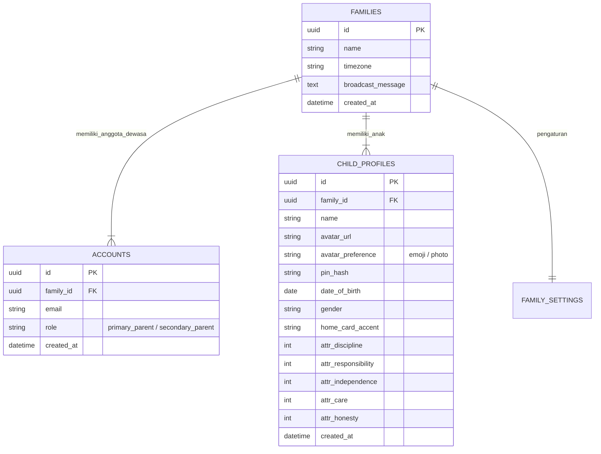

# PRD — Habiku (React Native + Expo)

Dokumen ini adalah **Product Requirements Document** resmi dan **lengkap** untuk **Habiku** — aplikasi pembentukan karakter anak (habit-tracker) berbasis **React Native + Expo + Supabase**. Dokumen ini ditulis agar **developer baru** yang membaca dokumen ini dari awal hingga akhir dapat **memahami, meniru, dan mengimplementasikan** seluruh aplikasi secara independen.

**Dokumen pendamping:**
- [`implementation-roadmap-react.md`](./implementation-roadmap-react.md) — Rencana tahapan implementasi (v1)
- [`fsd-punishment-habiku.md`](./fsd-punishment-habiku.md) — Spesifikasi fitur Sistem Konsekuensi & Perjanjian
- [`setup-wajib-v1.md`](./setup-wajib-v1.md) — Setup lingkungan (Supabase, Edge, webhook, EAS, env)
- [`build-and-deploy-app.md`](./build-and-deploy-app.md) — Panduan build & deploy

> **Status implementasi (audit codebase 2026-05-28):** Centang `[x]` di §3 dan kolom status di §9 mencerminkan keberadaan **kode + migrasi SQL** yang dapat diverifikasi di repositori. `[ ]` atau **⏳** berarti belum ada di migrasi/RPC, hanya sebagian UI/placeholder, atau verifikasi operasional di luar repo.

---

## 1. Overview

### 1.1. Masalah

Anak-anak lebih tertarik pada layar gawai/hiburan instan, sementara kebiasaan baik (ibadah, belajar, kebersihan, olahraga, mengelola uang) sering diabaikan atau dilakukan dengan terpaksa. Orang tua kesulitan memotivasi anak secara konsisten. Aplikasi keluarga yang ada terlalu sederhana, tidak mendukung multi-orang tua, rawan inkonsistensi data poin, dan kurang engagement.

### 1.2. Solusi

**Habiku** menghadirkan:
- **Target Visual Interaktif (Goal-Oriented Wishlist)** — setiap anak memonitor beberapa target aktif sekaligus
- **Mekanisme Gameplay RPG Ringan** — energi dari misi mengalir melalui Point Ledger lalu dialokasikan ke goal
- **Manajemen Keluarga** multi-orang tua (Primary + Secondary Parent)
- **Mode Anak (Child Mode)** — sesi perangkat khusus anak, dikunci PIN orang tua
- **Gamifikasi** — streak, daily quest, badge, daily check-in chain, misi sorotan, refleksi sore
- **Konsekuensi berbasis kesepakatan** (FSD) — visual layu, perjanjian HP decay (tanpa framing "hukuman")

### 1.3. Keputusan Stack

Habiku dibangun dengan **React Native + Expo** agar animasi reward dan feel native optimal — krusial untuk momen emosional (benih budi, level up) yang mendukung engagement. **Orang tua dan anak** memakai **aplikasi yang sama**; peran dan Child Mode memisahkan pengalaman. Backend: **Supabase** (PostgreSQL + Auth + Storage + Realtime). Preview development memakai **Expo Go** di perangkat fisik (scan QR).

### 1.4. Model Bisnis

Gratis (Free-to-use) untuk semua keluarga dengan operasional berbasis donasi dari komunitas (rencana masa depan; gateway lihat §7).

---

## 2. Requirements

### 2.1. Fungsional

| # | Kebutuhan | Detail |
|---|-----------|--------|
| F1 | **Aksesibilitas** | Satu app React Native + Expo untuk Android & iOS — **tanpa** klien web terpisah |
| F2 | **Manajemen Keluarga** | Multi-orang tua (Primary & Secondary Parent) dalam satu entitas Keluarga |
| F3 | **Profil Anak** | CRUD profil anak, avatar, PIN child lock, data demografis (tanggal lahir, gender) |
| F4 | **Banyak Target (Goal)** | Setiap anak ≥1 target hadiah aktif; progres HP agregat di UI |
| F5 | **Daily Quests** | Tugas harian rutin dengan konfigurasi frekuensi dan batas submissions per periode |
| F6 | **Parental Approval** | Approve/Reject setiap misi anak dengan alasan + jejak audit |
| F7 | **Point Ledger** | Buku besar transaksi poin (earn, spend, adjustment, bonus_checkin) |
| F8 | **Goal Progress** | Alokasi poin ke target melalui `goal_progress_events` |
| F9 | **Streak** | Per kategori tugas + streak "hari penuh" semua misi harian aktif |
| F10 | **Child Mode** | Sesi anak dikunci PIN; keluar/ganti profil wajib PIN orang tua |
| F11 | **Bukti Misi** | Foto opsional dari kamera/galeri → Supabase Storage |
| F12 | **Push Notification** | FCM via Expo Notifications; trigger server-side lewat Edge Functions |
| F13 | **Misi Insidental** | Penghargaan sekali jalan dari orang tua di luar jadwal tugas |
| F14 | **Engagement Beranda Anak** | Daily check-in, misi sorotan, badge, tips edukatif, refleksi sore, kebun energi |
| F15 | **Validasi Tugas** | Konfirmasi manual orang tua untuk setiap misi |

### 2.2. Non-Fungsional

| # | Kebutuhan | Detail |
|---|-----------|--------|
| NF1 | **Mobile-first native** | Scroll & gesture native (Gesture Handler), safe area semua perangkat |
| NF2 | **Animasi 60fps** | Reanimated di UI thread untuk reward & gamifikasi |
| NF3 | **Offline/cache** | Strategi stale-while-revalidate via TanStack Query |
| NF4 | **Keamanan** | RLS + RPC sebagai garis pertahanan utama; anon key saja di bundle |
| NF5 | **Integritas Data** | Semua pergerakan poin tercatat di Ledger; approval/rejection punya jejak audit |

---

## 3. Core Features & Prioritization

### P0 — Fondasi inti

- [x] **Manajemen Keluarga & Peran Pengguna** — Primary & Secondary Parent
- [x] **Banyak target per anak** — beberapa goal aktif; progres HP agregat
- [x] **Daily Quests** — tugas harian dengan konfigurasi frekuensi & batas submit
- [x] **Parental Approval (Basic)** — Approve/Reject + audit trail
- [x] **Point Ledger & Allocation** — pencatatan transaksi poin + alokasi ke Goal
- [x] **Misi insidental (apresiasi ortu)** — `incidental_rewards` + RPC `give_incidental_reward`
- [x] **Basic Streak** — per kategori + `profile_full_daily_mission_streak`
- [x] **Child Mode (PIN-Locked)** — PIN orang tua via RPC `verify_child_profile_pin`
- [x] **Push & Notifikasi** — token push ortu + in-app notifications
- [x] **Dashboard ortu** — manajemen dalam satu app (tabs, antrean, target, profil, pengaturan)
- [x] **Daily check-in chain** — `daily_check_ins` + `award_daily_checkin_bonus`
- [x] **Hitung mundur target terdekat** — `compute_goal_countdown`
- [x] **Animasi mikro reward** — toggle `micro_anim_enabled` + Reduce Motion
- [ ] **Missed task log otomatis (FSD P0)** — ⏳ sebagian: `goals.visual_state` + UI; belum: job harian timezone keluarga
- [ ] **Rilis store (EAS)** — ⏳ konfigurasi ada, listing belum

### P1 — Pelengkap & gameplay lanjut

- [x] **Misi sorotan harian (Quest of the Day)** — `compute_featured_task` + multiplier
- [x] **Sticky note "Pesan dari Ortu" + reaksi** — `ChildBroadcastSticky` + `thank_broadcast_message`
- [x] **Koleksi badge** — `child_badges` + katalog + `award_eligible_badges`
- [x] **"Tahukah kamu" edukatif** — `learning_tips` + `pick_daily_tip`
- [ ] **Perjanjian konsekuensi (HP decay)** — ⏳ UI sebagian; DB + RPC belum
- [ ] **Tabungan Digital (Kantong)** — belum
- [ ] **Weekly Boss** — belum
- [ ] **Skill Tree (Attributes)** — belum
- [ ] **Mystery Rewards** — belum
- [ ] **Recovery Token** — belum
- [ ] **Co-op Missions** — belum

### P2 — Roadmap jangka panjang

- [x] **Sorotan saudara** — `pick_sibling_highlight` + opt-in
- [x] **Usul misi dari beranda** — `task_requests` + sheet cepat
- [x] **Kebun energi** — `app/(child)/garden.tsx` + toggle
- [x] **Refleksi sore** — `child_daily_reflections` + `submit_child_reflection`
- [ ] **Family Challenges** — belum
- [ ] **Community/Forum** — belum (risiko moderasi)
- [ ] **Donation System lanjut** — Midtrans/Xendit recurring

---

## 4. User Flow

### 4.1. Alur Orang Tua

```
┌─────────────┐     ┌──────────────┐     ┌───────────────────┐
│  Buka App    │────▶│ Login/Signup  │────▶│  Onboarding       │
│  (splash)    │     │ Email/Google  │     │  - Nama keluarga  │
└─────────────┘     └──────────────┘     │  - Profil anak    │
                                          └───────┬───────────┘
                                                  ▼
                    ┌──────────────────────────────────────────┐
                    │       Dashboard Orang Tua (Tabs)         │
                    ├──────────┬──────────┬──────────┬─────────┤
                    │ Beranda  │  Misi    │  Target  │ Profil  │
                    │          │          │          │  Anak   │
                    └────┬─────┴────┬─────┴────┬─────┴────┬────┘
                         │          │          │          │
                         ▼          ▼          ▼          ▼
                    Antrean    CRUD Task   CRUD Goal   CRUD Child
                    Approve    + Frekuensi + Gambar    + Avatar
                    /Reject    + Kategori  + Target HP + PIN
                    + Alasan   + Reward    + Visual    + Gender/DOB
```

### 4.2. Alur Anak (Child Mode)

```
┌──────────────┐     ┌─────────────────┐     ┌───────────────────┐
│ Ortu pilih   │────▶│  Child Mode     │────▶│  Beranda Anak     │
│ profil anak  │     │  (PIN locked)   │     │  - Energi hari ini│
└──────────────┘     └─────────────────┘     │  - Check-in chain │
                                              │  - Misi sorotan   │
                                              │  - Pesan ortu     │
                                              │  - Target/HP      │
                                              └───────┬───────────┘
                                                      ▼
                                              ┌───────────────────┐
                                              │  Selesai Misi     │
                                              │  + Foto bukti     │
                                              │  (opsional)       │
                                              └───────┬───────────┘
                                                      ▼
                                              ┌───────────────────┐
                                              │  Menunggu Ortu    │
                                              │  (layar submitted)│
                                              └───────────────────┘
```

### 4.3. Siklus Utama (Sequence)

```mermaid
sequenceDiagram
    actor Anak
    actor OrangTua
    participant App (Expo RN)
    participant Supabase Auth
    participant Supabase DB
    participant Supabase Realtime

    Anak->>App (Expo RN): Selesai misi + opsional foto (Image Picker)
    App (Expo RN)->>Supabase Auth: Validasi sesi (token klien)
    App (Expo RN)->>Supabase DB: Insert TASK_HISTORY (Pending, evidence URL)
    Supabase DB-->>App (Expo RN): Sukses

    Supabase Realtime->>OrangTua: Event task pending
    Note over OrangTua: Push (Expo Notifications / FCM) + in-app

    OrangTua->>App (Expo RN): Buka antrean & detail (layar ortu)
    alt Approve
        OrangTua->>Supabase DB: RPC approve (dari app)
        Supabase DB->>Supabase DB: Ledger + GOAL_PROGRESS + STREAKS + visual goal (atomik)
    else Reject
        OrangTua->>Supabase DB: RPC reject + alasan
        Note over Supabase DB: Tanpa perubahan poin
    end

    Note over Supabase DB: Job terjadwal (00:05 tz keluarga): mark missed; opsional decay perjanjian aktif (FSD)

    Supabase Realtime->>App (Expo RN): Update status & poin
    App (Expo RN)->>Anak: Animasi + haptics (Reanimated / Lottie)

    alt Target tercapai
        App (Expo RN)->>Anak: Selebrasi native
    end
```

---

## 5. Architecture

### 5.1. Prinsip Arsitektur

- **Satu klien aplikasi** — Habiku (Expo) — untuk orang tua **dan** anak (alur & layout berbeda, bukan app terpisah)
- **Keamanan di server** — RLS + RPC/trigger di PostgreSQL; tidak mengandalkan "rahasia" di bundle
- **Routing berbasis file** — Expo Router (file-based, deep linking); grup rute: `(auth)`, `(parent)`, `(child)`
- **State management** — Zustand (persisted ke AsyncStorage) + TanStack Query (server state cache)
- **Mutasi sensitif** — RLS + RPC atomik (approve, reject, PIN verify, badge grant, dll.)

### 5.2. Pola Engineering

| Aspek | Pola | Detail |
|-------|------|--------|
| **Routing** | Expo Router (file-based) | Grup rute terpisah auth / parent / child |
| **Auth & sesi** | `@supabase/supabase-js` | Refresh token + `onAuthStateChange` + `AsyncStorage` |
| **Google Sign-In** | `@react-native-google-signin/google-signin` | OAuth Client ID dari Google Cloud Console |
| **Server state** | TanStack Query v5 | stale-while-revalidate, invalidasi via Realtime |
| **Client state** | Zustand (persisted) | `activeChildProfileId`, `familySettings`, `familyBroadcastMessage` |
| **Form** | React Hook Form + Zod | Validasi client-side sebelum mutasi |
| **Animasi** | Reanimated v4 + Lottie | 60fps native thread |
| **OTA** | Expo Updates | Patch JS/asset tanpa submit ulang store |
| **Build/Deploy** | EAS Build + EAS Submit | Cloud build → Play Store & App Store |
| **Monitoring** | PostHog (aktif), Sentry (ditunda — lihat roadmap §8.1.1) | PostHog jika `EXPO_PUBLIC_POSTHOG_KEY` diisi |

---

## 6. Project Structure (Codebase Map)

Struktur folder utama beserta penjelasan fungsi masing-masing, sehingga developer baru langsung tahu harus mengedit di mana.

```
habiku-dev/
├── app/                          # Expo Router — semua layar (file-based routing)
│   ├── _layout.tsx               # Root layout: font, providers, Stack navigator
│   ├── index.tsx                 # Entry redirect (ke splash)
│   ├── splash.tsx                # Splash screen animasi
│   ├── welcome.tsx               # Layar welcome (belum login)
│   ├── (auth)/                   # Grup rute autentikasi
│   │   ├── _layout.tsx
│   │   ├── login.tsx             # Login email/password
│   │   └── sign-up.tsx           # Registrasi email/password
│   ├── auth/
│   │   └── callback.tsx          # OAuth callback handler
│   ├── onboarding/               # Onboarding pasca-signup
│   │   ├── index.tsx             # Step 1: intro
│   │   └── family.tsx            # Step 2: buat keluarga + profil anak pertama
│   ├── invite/
│   │   ├── _layout.tsx
│   │   └── [token].tsx           # Deep link undangan Secondary Parent
│   ├── (parent)/                 # Grup rute orang tua
│   │   ├── _layout.tsx           # Parent layout + guard
│   │   ├── (tabs)/               # Bottom tab navigation
│   │   │   ├── _layout.tsx       # Tab bar config
│   │   │   ├── index.tsx         # Beranda ortu (33KB — dashboard utama)
│   │   │   ├── tasks.tsx         # Tab Misi — daftar task per anak
│   │   │   ├── targets.tsx       # Tab Target — daftar goal per anak
│   │   │   ├── profil-anak.tsx   # Tab Profil Anak — daftar profil + entry Child Mode
│   │   │   └── agreements.tsx    # Tab Perjanjian (P1, saat ini local store)
│   │   ├── queue/                # Antrean approval
│   │   │   ├── _layout.tsx
│   │   │   ├── index.tsx         # Daftar task pending
│   │   │   └── [taskHistoryId].tsx  # Detail approval (approve/reject)
│   │   ├── goal/
│   │   │   └── [profileId].tsx   # CRUD goal per anak (31KB)
│   │   ├── targets/
│   │   │   └── [profileId].tsx   # Daftar target per profil anak
│   │   ├── agreements/
│   │   │   └── [profileId].tsx   # Perjanjian per anak (P1)
│   │   ├── settings/
│   │   │   ├── index.tsx         # Pengaturan umum
│   │   │   └── engagement.tsx    # Pengaturan engagement (toggle fitur §14)
│   │   ├── child/                # Manajemen anak (dari tab parent)
│   │   ├── task-form.tsx         # Form CRUD misi (23KB)
│   │   ├── family.tsx            # Pengaturan keluarga
│   │   ├── edit-family-profile.tsx
│   │   ├── edit-parent-profile.tsx
│   │   ├── notifications.tsx     # Notifikasi ortu
│   │   ├── point-ledger.tsx      # Riwayat poin (ledger viewer)
│   │   ├── aktivitas-terbaru.tsx # Feed aktivitas terbaru
│   │   └── home-wallpaper.tsx    # Pilih wallpaper beranda
│   └── (child)/                  # Grup rute anak (Child Mode)
│       ├── _layout.tsx           # Child layout + PIN guard
│       ├── (main)/               # Tab utama anak
│       │   ├── _layout.tsx
│       │   ├── index.tsx         # Beranda anak (redirect)
│       │   ├── my-missions.tsx   # Daftar misi anak (24KB)
│       │   └── targets.tsx       # Target/goal anak (20KB)
│       ├── target/
│       │   └── [goalId].tsx      # Detail goal anak (16KB)
│       ├── complete/
│       │   └── [taskId].tsx      # Layar selesai misi + bukti (15KB)
│       ├── agreement/
│       │   └── [agreementId].tsx # Detail perjanjian (anak — P1)
│       ├── badges.tsx            # Koleksi badge (6KB)
│       ├── garden.tsx            # Kebun energi (7KB)
│       ├── notifications.tsx     # Notifikasi anak (8KB)
│       └── submitted.tsx         # Layar "menunggu ortu" (5KB)
│
├── components/                   # Komponen UI reusable
│   ├── child/                    # Komponen khusus Child Mode (18 files)
│   │   ├── ChildModeHomeScreen.tsx       # Beranda anak utama (61KB — komponen terbesar)
│   │   ├── ChildDailyCheckInChain.tsx    # Rantai check-in 7 hari
│   │   ├── ChildBroadcastSticky.tsx      # Sticky note pesan ortu
│   │   ├── ChildBadgeShelf.tsx           # Rak badge beranda
│   │   ├── ChildDailyTipStrip.tsx        # Strip "Tahukah kamu"
│   │   ├── ChildEveningReflectionSheet.tsx # Bottom sheet refleksi sore
│   │   ├── ChildExitPinSheet.tsx         # PIN sheet untuk keluar Child Mode
│   │   ├── ChildGoalRequestModal.tsx     # Modal request goal baru
│   │   ├── ChildHomeNotificationsList.tsx # Daftar notifikasi beranda
│   │   ├── ChildIdeaTaskQuickSheet.tsx   # Sheet usul misi cepat
│   │   ├── ChildModeBottomBar.tsx        # Bottom bar navigasi anak
│   │   ├── ChildModeTopChrome.tsx        # Top chrome (header anak)
│   │   ├── ChildSiblingHighlightStrip.tsx # Strip sorotan saudara
│   │   ├── ChildGoalCompletedCelebration.tsx # Selebrasi goal tercapai
│   │   ├── ChildNotificationsHeaderButton.tsx
│   │   ├── TaskEvidenceSheet.tsx         # Sheet upload bukti misi
│   │   ├── ChildGenderField.tsx
│   │   └── DateOfBirthField.tsx
│   ├── parent/                   # Komponen khusus orang tua (30 files)
│   │   ├── ParentFamilyEnergyHero.tsx    # Hero card energi keluarga (16KB)
│   │   ├── ParentHomeChildrenSection.tsx # Seksi anak di beranda ortu
│   │   ├── ParentChildDayResumeCard.tsx  # Kartu resume harian anak (16KB)
│   │   ├── ParentChildEngagementSheet.tsx # Bottom sheet engagement per anak (15KB)
│   │   ├── ParentIncidentalRewardSheet.tsx # Sheet reward insidental (15KB)
│   │   ├── ParentAgreementFormModal.tsx  # Form perjanjian (24KB)
│   │   ├── ParentGoalHpTransferSheet.tsx # Transfer HP antar goal (14KB)
│   │   ├── ParentEngagementInsightCard.tsx # Kartu insight engagement
│   │   ├── ParentEngagementKontenCard.tsx # Kartu konten & kontrol
│   │   ├── ParentEngagementPesanCard.tsx  # Kartu pesan & sorotan
│   │   ├── ParentTaskRequestReviewBlock.tsx # Review request task
│   │   ├── ParentFeaturedMissionPicker.tsx # Picker misi sorotan
│   │   ├── ParentGoalRequestReviewBlock.tsx # Review goal request
│   │   ├── LearningTipsCuratorModal.tsx  # Modal curator tips edukatif
│   │   ├── ParentCustomTabBar.tsx        # Custom bottom tab bar
│   │   ├── ParentHomeActivityFeed.tsx    # Feed aktivitas beranda
│   │   ├── ParentIncidentalLogBlock.tsx  # Log reward insidental
│   │   ├── ParentReauthModal.tsx         # Modal re-auth sensitif
│   │   ├── ParentAgreementMoodStrip.tsx  # Strip mood perjanjian
│   │   ├── ParentTaskFeaturedStrip.tsx   # Strip misi sorotan
│   │   ├── ParentGoalCountdownPill.tsx   # Pill countdown goal
│   │   ├── ParentEngagementSettingsHint.tsx
│   │   ├── ParentHomeGlassHeader.tsx
│   │   ├── ParentHomeWallpaperShell.tsx
│   │   ├── ParentNotificationsHeaderButton.tsx
│   │   ├── ParentSettingsHeaderButton.tsx
│   │   ├── ChildAvatar.tsx               # Render avatar anak
│   │   ├── ChildProfileOrEmoji.tsx
│   │   ├── DashboardStatCardAccents.tsx
│   │   └── GoalRowThumb.tsx
│   ├── auth/                     # Komponen autentikasi
│   ├── onboarding/               # Komponen onboarding
│   ├── family/
│   │   └── SharedGoalCelebrationModal.tsx
│   ├── habiku/                   # Brand components
│   │   ├── HabikuLogo.tsx
│   │   └── GoogleMark.tsx
│   ├── ui/                       # Komponen UI generik
│   │   ├── CelebrationBurst.tsx  # Efek konfetti/burst
│   │   ├── HabikuSuccessLottie.tsx
│   │   └── HabikuSuccessLottie.web.tsx
│   └── layout/                   # Layout wrappers (kosong saat ini)
│
├── lib/                          # Business logic & data layer
│   ├── supabase/                 # Supabase client setup
│   │   ├── client.ts             # Singleton client (getSupabase())
│   │   ├── rpc.ts                # Typed RPC helper
│   │   └── read-at-most-one.ts   # Query helper single-row
│   ├── auth/                     # Autentikasi
│   │   ├── auth-store.ts         # Zustand store untuk sesi
│   │   ├── google-oauth.ts       # Google Sign-In flow
│   │   ├── account.ts            # Account queries
│   │   ├── navigate-after-auth.ts
│   │   ├── pending-invite.ts
│   │   ├── postgrest-auth-error.ts
│   │   └── sign-out-habiku.ts    # Sign-out + cleanup
│   ├── stores/                   # Zustand stores (persisted)
│   │   ├── app-store.ts          # activeChildProfileId, familySettings, broadcastMessage
│   │   └── parent-agreements-local-store.ts  # Perjanjian local (P1 → migrasi ke DB)
│   ├── providers/                # React providers
│   │   ├── AppProviders.tsx      # Komposisi: GestureHandler + SafeArea + Query + Session
│   │   ├── SupabaseSessionRoot.tsx # Listener auth state + auto-refresh
│   │   ├── AppForegroundRefresher.tsx # Refresh data saat app kembali aktif
│   │   └── query-client.ts       # TanStack Query client config
│   ├── child/                    # Logic khusus child (19 files)
│   │   ├── child-dashboard.ts    # fetchChildDashboard — query utama beranda anak (24KB)
│   │   ├── daily-check-in.ts     # Award daily check-in
│   │   ├── badges.ts             # Badge queries
│   │   ├── badge-catalog.ts      # Katalog badge (hardcoded)
│   │   ├── reflection.ts         # Submit refleksi sore
│   │   ├── broadcast-thanks.ts   # Thank broadcast message
│   │   ├── daily-tip.ts          # Pick daily tip
│   │   ├── sibling-highlight.ts  # Sorotan saudara
│   │   ├── task-evidence.ts      # Upload bukti misi
│   │   ├── in-app-notifications.ts
│   │   ├── child-missions-history.ts
│   │   ├── goal-celebration.ts
│   │   ├── avatar.ts
│   │   ├── age.ts
│   │   ├── child-avatar-preference.ts
│   │   ├── child-gender.ts
│   │   ├── child-home-card-accent.ts
│   │   ├── child-profiles-migration-fallback.ts
│   │   └── energy-hero-theme.ts
│   ├── parent/                   # Logic khusus orang tua (14 files)
│   │   ├── approval-queue.ts     # Query antrean approval
│   │   ├── goal-targets.ts       # CRUD goals (6.5KB)
│   │   ├── parent-home-activity.ts # Feed aktivitas beranda (8KB)
│   │   ├── goal-hp-transfer.ts   # Transfer HP antar goal
│   │   ├── incidental-rewards.ts # Beri reward insidental
│   │   ├── agreements.ts         # Perjanjian queries
│   │   ├── featured-task.ts      # Compute featured task
│   │   ├── goal-countdown.ts     # Hitung mundur target
│   │   ├── learning-tips.ts      # CRUD tips edukatif
│   │   ├── invalidate-parent-home.ts # Helper invalidasi cache
│   │   ├── parent-child-day-resume.ts
│   │   ├── in-app-notifications.ts
│   │   ├── sensitive-reauth.ts
│   │   └── task-display.ts
│   ├── hooks/                    # Custom React hooks
│   │   ├── use-family-realtime.ts # Supabase Realtime subscription
│   │   ├── use-family-timezone.ts # Timezone keluarga
│   │   ├── use-refetch-on-app-foreground.ts
│   │   └── use-refetch-on-focus.ts
│   ├── navigation/
│   │   └── child-mode-store.ts   # Zustand store Child Mode state
│   ├── notifications/            # Push notification
│   │   ├── expo-handler.ts       # Expo notification handler init
│   │   ├── notification-navigation.tsx # Deep link dari notifikasi
│   │   ├── register-parent-push.ts     # Register push token ortu
│   │   └── notification-ui.ts
│   ├── observability/
│   │   └── init-observability.ts # PostHog + Sentry (dynamic import)
│   ├── invite/
│   │   └── invite-link.ts        # Generate/parse link undangan
│   ├── goal/
│   │   └── image.ts              # Upload gambar goal
│   ├── media/                    # Media utilities
│   │   ├── image-library-options.ts
│   │   └── prepare-image-upload.ts
│   ├── ui/                       # UI utilities
│   │   ├── habiku-page-bg.ts     # Background color constant
│   │   ├── parent-home-wallpaper.ts # Wallpaper presets
│   │   ├── child-mode-chrome.ts
│   │   └── confirm-native-or-web.ts
│   ├── family-settings.ts        # Type + defaults FamilySettings (10KB)
│   ├── family-broadcast-message.ts
│   ├── family-shared-goal.ts
│   └── timezone.ts               # Timezone utility (7KB)
│
├── constants/
│   ├── Colors.ts                 # Palet warna app
│   └── createspace.ts            # Spacing constants
│
├── supabase/                     # Supabase project
│   ├── config.toml               # Supabase local config
│   ├── migrations/               # 59 migration files (lihat §6.2)
│   └── functions/                # Edge Functions
│       ├── mark-missed-tick/     # Job mark missed tasks
│       ├── notify-parents-goal-request/
│       └── notify-parents-task-pending/
│
├── assets/                       # Gambar, font, ikon
├── app.config.ts                 # Expo config (plugins, scheme, EAS)
├── eas.json                      # EAS Build profiles
├── babel.config.js               # Babel (Reanimated, NativeWind)
├── metro.config.js               # Metro bundler config
├── tailwind.config.js            # NativeWind/Tailwind config
├── tsconfig.json                 # TypeScript (strict, path alias @/*)
├── package.json                  # Dependencies
├── global.css                    # Tailwind entry
├── .env.example                  # Template environment variables
└── docs/                         # Dokumentasi
    ├── prd-habiku-react.md       # Dokumen ini
    ├── implementation-roadmap-react.md
    ├── fsd-punishment-habiku.md
    ├── setup-wajib-v1.md
    ├── build-and-deploy-app.md
    └── habiku-ui-design/         # Prototipe UI
```

### 6.1. Konvensi Kode

| Aspek | Konvensi |
|-------|----------|
| **Bahasa** | TypeScript strict mode |
| **Path alias** | `@/*` → root project (contoh: `@/lib/supabase/client`) |
| **Naming files** | kebab-case untuk `.ts/.tsx` (contoh: `child-dashboard.ts`) |
| **Naming komponen** | PascalCase (contoh: `ChildModeHomeScreen.tsx`) |
| **State management** | Zustand untuk client state; TanStack Query untuk server state |
| **Form validation** | React Hook Form + Zod schema |
| **Styling** | NativeWind (Tailwind syntax untuk React Native) |
| **Font** | DM Sans (body), Poppins (heading) — loaded di root `_layout.tsx` |

### 6.2. Daftar Migrasi SQL (59 files)

Migrasi di `supabase/migrations/` — dijalankan berurutan:

| Migrasi | Deskripsi |
|---------|-----------|
| `20260422_initial_schema` | Families, accounts, child_profiles, goals |
| `20260423_phase1_tasks_history_ledger` | Tasks, task_history, point_ledger, streaks, notifications, RPC |
| `20260424_phase2_family_invites` | Undangan secondary parent |
| `20260425_fix_rls_accounts_recursion` | Perbaikan RLS |
| `20260426_phase3_child_profiles_rpc_storage` | RPC profil anak + Storage policies |
| `20260427_phase3_goal_images` | Upload gambar goal + validasi submit |
| `20260428_multiple_active_goals` | Multiple active goals per child |
| `20260429_task_evidence_storage` | Storage untuk bukti misi |
| `20260430_approve_task_history` | RPC approve atomik (ledger + goal progress) |
| `20260431_phase5_parent_notify` | Push token ortu |
| `20260501_verify_child_profile_pin` | RPC verifikasi PIN anak |
| `20260502_fix_verify_pin` | Perbaikan RPC PIN |
| `20260515_goal_requests` | Request goal dari anak |
| `20260515_goal_request_notify` | Notifikasi goal request ke ortu |
| `20260526_child_profiles_avatar_preference` | Preferensi avatar (emoji/foto) |
| `20260527_child_profiles_dob_gender` | Tanggal lahir + gender |
| `20260528_update_child_profile` | Update profil termasuk avatar preference |
| `20260529_child_profiles_home_card_accent` | Aksen warna kartu beranda anak |
| `20260530_child_avatars_storage_rls` | RLS path check Storage avatar |
| `20260531_goal_requests_grant` | Grant authenticated untuk goal requests |
| `20260531_goal_request_review_notification` | Notifikasi review goal request |
| `20260601_goal_images_storage_rls` | RLS Storage gambar goal |
| `20260602_goals_visual_state` | `goals.visual_state` (segar/layu/dormant) |
| `20260603_child_in_app_notify` | Notifikasi in-app anak → ortu |
| `20260604_task_submit_quota` | Validasi quota submit + pending slots |
| `20260607_family_broadcast_message` | Kolom broadcast message di families |
| `20260608_profile_full_daily_mission_streak` | RPC streak hari penuh |
| `20260609_task_requests` | Request task dari anak (usul misi) |
| `20260610_approve_task_request` | RPC approve task request |
| `20260611_task_evidence_storage_rls` | Security definer untuk evidence |
| `20260612_incidental_rewards` | Tabel + RPC reward insidental |
| `20260613_phase9_family_settings` | `family_settings` (toggle engagement) |
| `20260613_phase9_daily_check_ins` | `daily_check_ins` |
| `20260613_phase9_award_daily_checkin` | RPC `award_daily_checkin_bonus` |
| `20260613_phase9_compute_goal_countdown` | RPC `compute_goal_countdown` |
| `20260613_phase9_thanks_broadcast` | RPC `thank_broadcast_message` |
| `20260613_phase9_featured_task` | RPC `compute_featured_task` + multiplier |
| `20260613_phase9_learning_tips` | `learning_tips` + RPC `pick_daily_tip` |
| `20260613_phase9_child_badges` | `child_badges` + RPC `award_eligible_badges` |
| `20260613_phase9_sibling_highlight` | RPC `pick_sibling_highlight` |
| `20260613_phase9_child_reflections` | `child_daily_reflections` + RPC |
| `20260614_task_history_status_missed` | Enum `missed` pada `task_history` |
| `20260614_phase6_missed_tasks_tick` | RPC `mark_missed_tasks_tick` (11KB) |
| `20260615_parent_sticky_per_child` | Pesan sticky per anak |
| `20260616_family_settings_idempotent` | Idempotent upsert family_settings |
| `20260616_family_settings_grants` | Grant access family_settings |
| `20260617_task_per_period_pending` | Validasi submit per period |
| `20260617_parent_featured_task_pick` | RPC ortu pilih featured task |
| `20260618_realtime_publication` | Realtime publication core tables |
| `20260619_submit_child_reflection_*` (3 files) | Perbaikan RPC refleksi |
| `20260619_grant_select_*` (2 files) | Grant SELECT check-ins + reflections |
| `20260619_family_settings_daily_check_in_bonus` | Bonus check-in per settings |
| `20260620_set_child_parent_sticky_message` | RPC set sticky message per anak |
| `20260620_set_family_broadcast_message` | RPC set broadcast message keluarga |
| `20260621_family_shared_goal` | Goal bersama keluarga |
| `20260624_goal_hp_transfer` | RPC transfer HP antar goal |
| `20260625_compute_check_in_chain_family_tz` | RPC check-in chain berbasis timezone |

### 6.3. Edge Functions (Supabase)

| Function | Trigger | Deskripsi |
|----------|---------|-----------|
| `mark-missed-tick` | Cron / manual | Tandai task yang tidak dikerjakan sebagai `missed` |
| `notify-parents-goal-request` | Database webhook | Push notifikasi ke ortu saat anak request goal |
| `notify-parents-task-pending` | Database webhook | Push notifikasi ke ortu saat anak submit misi |

---

## 7. Tech Stack (Versi Aktual)

### Layer aplikasi (mobile)

| Layer | Teknologi | Versi (package.json) | Alasan |
|-------|-----------|----------------------|--------|
| **Runtime** | React Native | 0.81.5 | Komponen native Android & iOS |
| **Dev Platform** | Expo SDK | ~54.x | Tooling lengkap, OTA, managed workflow |
| **Routing** | Expo Router | ~6.x | File-based routing, deep linking, typed routes |
| **State (client)** | Zustand | ^5.x | Ringan, persisted ke AsyncStorage |
| **State (server)** | TanStack Query | ^5.x | Caching + sync data Supabase |
| **Styling** | NativeWind + Tailwind CSS | ^4.2 + ^3.4 | Sintaks Tailwind untuk React Native |
| **Animasi** | React Native Reanimated | ~4.1 | ~60fps di native thread |
| **Lottie** | lottie-react-native | ~7.3 | Animasi JSON kompleks (reward, level up) |
| **Form** | React Hook Form + Zod | ^7.73 + ^4.3 | Validasi form |
| **Font** | DM Sans + Poppins | Google Fonts | Tipografi branded |

### Backend & infrastruktur

| Layer | Teknologi | Alasan |
|-------|-----------|--------|
| **BaaS** | Supabase | PostgreSQL + Auth + Storage + Realtime |
| **Database** | PostgreSQL (Supabase) | Relasional — misi & keluarga |
| **Authentication** | Supabase Auth | Email/password + Google OAuth (ortu) |
| **File Storage** | Supabase Storage | Foto bukti misi + avatar |
| **Realtime** | Supabase Realtime | Status verifikasi live ke anak |
| **Edge Functions** | Supabase Edge (Deno) | Cron jobs + webhook handlers |

### Native & perangkat

| Kebutuhan | Library | Versi |
|-----------|---------|-------|
| **Kamera/foto** | Expo Image Picker | ~17.x |
| **Push (FCM)** | Expo Notifications | ~0.32 |
| **Gesture** | React Native Gesture Handler | ~2.28 |
| **Safe area** | React Native Safe Area Context | ~5.6 |
| **Haptics** | Expo Haptics | ~15.x |
| **Splash** | Expo Splash Screen | ~31.x |
| **SVG** | React Native SVG | 15.12 |
| **Gradient** | Expo Linear Gradient | ~15.x |
| **Blur** | Expo Blur | ~15.x |
| **Image manipulation** | Expo Image Manipulator | ~14.x |
| **Google Sign-In** | @react-native-google-signin | ^16.1 |
| **Async Storage** | @react-native-async-storage | 2.2 |
| **Slider** | @react-native-community/slider | 5.0 |

### Monitoring & analytics

| Kebutuhan | Teknologi | Status |
|-----------|-----------|--------|
| **Product analytics** | PostHog (`posthog-react-native` ^4.44) | Aktif jika env diisi |
| **Error monitoring** | Sentry | Ditunda (lihat roadmap §8.1.1) |
| **OTA** | Expo Updates | Aktif |

### Pembayaran & donasi (rencana)

| Gateway | Kapan | MDR | Catatan |
|---------|-------|-----|---------|
| Trakteer / Saweria | Tahap awal | 5–7% | Redirect WebView |
| QRIS statis | Tahap awal | ~0.7% | Setup mudah |
| Midtrans | P2 | 0.7–2% | In-app native |
| Xendit | P2 | 1.5–2.5% | Recurring bulanan |

### Development workflow

| Kebutuhan | Cara |
|-----------|------|
| **Preview mobile** | `npx expo start` + Expo Go (scan QR) |
| **Tunnel** | `npx expo start --tunnel` (beda WiFi) |
| **Build APK uji** | `eas build -p android --profile preview` |
| **Rilis store** | EAS Build + EAS Submit |
| **OTA** | Expo Updates |

---

## 8. Environment Setup

### 8.1. Prerequisites

- Node.js ≥ 18
- npm atau yarn
- Expo CLI (`npx expo`)
- EAS CLI (`npx eas-cli`) — untuk build
- Supabase CLI — untuk migrasi lokal
- Perangkat fisik Android/iOS + Expo Go (development)

### 8.2. Environment Variables (`.env.local`)

Salin `.env.example` ke `.env.local` dan isi:

```bash
# Wajib — dari Supabase Dashboard (Project Settings → API)
EXPO_PUBLIC_SUPABASE_URL=https://xxx.supabase.co
EXPO_PUBLIC_SUPABASE_ANON_KEY=eyJ...

# Google Sign-In — dari Google Cloud Console (OAuth 2.0)
EXPO_PUBLIC_GOOGLE_WEB_CLIENT_ID=xxx.apps.googleusercontent.com
EXPO_PUBLIC_GOOGLE_IOS_URL_SCHEME=com.googleusercontent.apps.xxx

# Opsional — Universal Link host (undangan)
# EXPO_PUBLIC_UNIVERSAL_LINK_HOST=app.habiku.id

# Opsional — EAS Project ID
# EXPO_PUBLIC_EAS_PROJECT_ID=61c3304e-...

# Opsional — Push notification kontrol
# EXPO_PUBLIC_DISABLE_CLIENT_PUSH_INVOKE=1

# Opsional — Observability
# EXPO_PUBLIC_SENTRY_DSN=https://...@....ingest.sentry.io/...
# EXPO_PUBLIC_POSTHOG_KEY=phc_...
# EXPO_PUBLIC_POSTHOG_HOST=https://us.i.posthog.com
```

> **PENTING:** Service role key **tidak boleh** masuk bundle klien. Hanya `EXPO_PUBLIC_*` variables yang terekspos ke app.

### 8.3. Quick Start

```bash
# 1. Clone repo
git clone <repo-url> habiku-dev && cd habiku-dev

# 2. Install dependencies
npm install

# 3. Setup environment
cp .env.example .env.local
# Edit .env.local — isi Supabase URL & anon key minimal

# 4. Jalankan dev server
npx expo start
# Scan QR dengan Expo Go di perangkat fisik

# 5. (Opsional) Supabase lokal
supabase start
supabase db push
```

---

## 9. Database Schema

Sistem menggunakan PostgreSQL di Supabase. Diagram ER di bawah mencakup **seluruh entitas** yang ada di migrasi saat ini.

### 9.1. Core Entities



### 9.2. Task & Goal System

```mermaid
erDiagram
    CHILD_PROFILES ||--o{ GOALS : memiliki_target
    CHILD_PROFILES ||--o{ TASKS : ditugaskan_misi
    CHILD_PROFILES ||--o{ TASK_HISTORY : riwayat
    CHILD_PROFILES ||--o{ POINT_LEDGER : transaksi_poin
    CHILD_PROFILES ||--o{ GOAL_PROGRESS_EVENTS : alokasi_poin
    CHILD_PROFILES ||--o{ STREAKS : konsistensi

    GOALS {
        uuid id PK
        uuid profile_id FK
        string title
        string image_url
        int target_hp
        int current_hp "Cached from goal_progress_events"
        string status "active / completed"
        string visual_state "fresh / slightly_wilted / wilted / dormant"
        datetime created_at
    }

    TASKS {
        uuid id PK
        uuid profile_id FK
        string title
        string category "ibadah / belajar / kebersihan / olahraga / lainnya"
        int reward_points
        string frequency_type "daily / weekly / custom"
        jsonb frequency_config
        int max_submissions_per_period
        boolean is_active
        datetime created_at
    }

    TASK_HISTORY {
        uuid id PK
        uuid task_id FK
        uuid profile_id FK
        uuid approved_by_account_id FK
        uuid rejected_by_account_id FK
        datetime completed_at
        datetime approved_at
        datetime rejected_at
        string status "pending / approved / rejected / missed"
        date period_date "periode misi (FSD)"
        datetime missed_at
        string rejection_reason
        string evidence_url
        string notes
    }

    POINT_LEDGER {
        uuid id PK
        uuid profile_id FK
        uuid account_id FK
        int amount
        string type "earn / spend / adjustment / bonus_checkin / mystery_bonus"
        string reference_id
        datetime created_at
    }

    GOAL_PROGRESS_EVENTS {
        uuid id PK
        uuid profile_id FK
        uuid goal_id FK
        uuid ledger_id FK
        int amount
        datetime created_at
    }

    STREAKS {
        uuid id PK
        uuid profile_id FK
        string task_category
        int current_streak
        int best_streak
        date last_completed_date
        boolean is_recovery_active
    }
```



### 9.3. Engagement Layer

```mermaid
erDiagram
    CHILD_PROFILES ||--o{ DAILY_CHECK_INS : check_in_harian
    CHILD_PROFILES ||--o{ CHILD_BADGES : koleksi_lencana
    CHILD_PROFILES ||--o{ CHILD_DAILY_REFLECTIONS : refleksi_harian
    CHILD_PROFILES ||--o{ INCIDENTAL_REWARDS : reward_insidental
    CHILD_PROFILES ||--o{ TASK_REQUESTS : usul_misi
    CHILD_PROFILES ||--o{ GOAL_REQUESTS : usul_target

    FAMILY_SETTINGS {
        uuid family_id PK_FK
        boolean micro_anim_enabled "default true"
        string featured_multiplier "1.5x / 2x / 3x"
        boolean daily_tip_enabled "default true"
        boolean show_sibling_highlight "default false"
        boolean check_in_reminder_enabled "default true"
        boolean family_garden_enabled "default true"
        int daily_check_in_bonus "default 2"
        datetime updated_at
    }

    DAILY_CHECK_INS {
        uuid id PK
        uuid profile_id FK
        date check_in_date "UNIQUE per profile"
        int bonus_awarded
        uuid ledger_id FK
        datetime created_at
    }

    CHILD_BADGES {
        uuid id PK
        uuid profile_id FK
        string badge_key "UNIQUE per profile"
        datetime earned_at
        datetime dismissed_from_home_at
    }

    LEARNING_TIPS {
        uuid id PK
        uuid family_id FK
        string category
        string language
        string title
        string body
        string source_url
        boolean is_active
    }

    CHILD_DAILY_REFLECTIONS {
        uuid id PK
        uuid profile_id FK
        date reflection_date "UNIQUE per profile"
        string mood "sangat_senang / senang / biasa / kurang_senang"
        uuid top_task_id FK
        text note
        datetime created_at
    }

    NOTIFICATIONS {
        uuid id PK
        uuid recipient_id FK
        string recipient_type "account / profile"
        string type
        string content
        boolean is_read
        datetime created_at
    }

    INCIDENTAL_REWARDS {
        uuid id PK
        uuid profile_id FK
        uuid given_by_account_id FK
        int amount
        string reason
        uuid goal_id FK
        datetime created_at
    }

    TASK_REQUESTS {
        uuid id PK
        uuid profile_id FK
        string title
        text note
        string status "pending / approved / rejected"
        datetime created_at
    }
```

### 9.4. Entitas Masa Depan (P1)

| Tabel | Sub-fase | Status |
|-------|----------|--------|
| `consequence_agreements` | 10.A | Belum |
| `consequence_agreement_tasks` | 10.A | Belum |
| `consequence_executions` | 10.A | Belum |
| `child_pockets` | 10.B | Belum |
| `attribute_grants` | 10.C | Belum |
| `weekly_bosses` | 10.D | Belum |
| `weekly_boss_progress` | 10.D | Belum |

---

## 10. RPC & Server Functions

Daftar Remote Procedure Call (RPC) yang tersedia di PostgreSQL, dipanggil dari klien via `supabase.rpc('nama', { params })`:

### 10.1. Core RPCs

| RPC | Deskripsi | Atomik? |
|-----|-----------|---------|
| `approve_task_history(task_history_id, account_id, goal_id?)` | Setujui misi → ledger `earn` + goal_progress + streak update + visual_state | ✅ |
| `reject_task_history(task_history_id, account_id, reason)` | Tolak misi — tanpa mutasi poin | ✅ |
| `verify_child_profile_pin(profile_id, pin)` | Verifikasi PIN anak (return boolean) | — |
| `give_incidental_reward(profile_id, amount, reason, goal_id?)` | Reward insidental dari ortu | ✅ |
| `mark_missed_tasks_tick(family_id?)` | Tandai task tanpa submit sebagai `missed` | ✅ |
| `profile_full_daily_mission_streak(profile_id)` | Hitung streak hari penuh | — |
| `transfer_goal_hp(from_goal_id, to_goal_id, amount)` | Transfer HP antar goal | ✅ |

### 10.2. Engagement RPCs

| RPC | Deskripsi |
|-----|-----------|
| `award_daily_checkin_bonus(profile_id)` | Idempotent harian; INSERT check_in + ledger `bonus_checkin` |
| `compute_goal_countdown(profile_id)` | Hitung mundur target terdekat (per goal, timezone keluarga) |
| `compute_featured_task(profile_id, day)` | Misi sorotan harian (deterministik per-tanggal) |
| `award_eligible_badges(profile_id)` | Grant badge yang memenuhi syarat (idempotent) |
| `pick_daily_tip(profile_id, day)` | Pilih tip edukatif harian (deterministik) |
| `pick_sibling_highlight(profile_id, day)` | Pilih sorotan saudara (deterministik) |
| `submit_child_reflection(profile_id, mood, top_task_id?, note?)` | Submit refleksi sore (UNIQUE per hari) |
| `thank_broadcast_message(profile_id)` | Kirim notifikasi terima kasih ke ortu |
| `compute_check_in_chain(profile_id)` | Hitung rantai check-in berbasis timezone keluarga |
| `set_child_parent_sticky_message(profile_id, message)` | Set pesan sticky per anak |
| `set_family_broadcast_message(family_id, message)` | Set broadcast message keluarga |
| `approve_task_request(request_id, account_id)` | Setujui usul misi dari anak → buat task baru |

---

## 11. Gameplay Mechanics

### 11.1. Skill Tree Karakter (P1 — belum implementasi)

Atribut embedded di profil anak: Disiplin, Tanggung Jawab, Kemandirian, Kepedulian, Kejujuran. Pertumbuhan dari `tasks.attribute_keys[]` → trigger `award_attributes_on_approve`. Tier: 1 (0–10) → 2 (11–30) → 3 (31–60) → 4 (61–100) → 5 (101+).

### 11.2. Sistem Streak

Streak per kategori tugas; reset sesuai `last_completed_date` vs hari kalender. Recovery token (P1): second chance oleh orang tua.

### 11.3. Mystery Reward (P1 — belum)

Probabilistik saat approval; `family_settings.mystery_reward_rate` (default 5%); isi: bonus poin / badge / pesan motivasi.

### 11.4. Daily Quest & Weekly Boss

Daily Quest (P0, implementasi lengkap) dengan `frequency_config`. Weekly Boss (P1, belum): tantangan mingguan keluarga.

### 11.5. Tabungan Digital / Kantong (P1 — belum)

Kantong virtual per profil anak (Investasi, Donasi, Pribadi + custom); setiap transfer tercatat di ledger.

### 11.6. Sistem Konsekuensi & Perjanjian (FSD)

**Filosofi:** Konsekuensi berbasis kesepakatan, berbahasa game ("layu", "tidur"), bukan "hukuman". Prinsip: reversibel, proporsional, transparan.

| Level | P0 (implementasi sebagian) | P1 (belum) |
|-------|---------------------------|------------|
| **Visual** | `goals.visual_state` (segar → sedikit layu → layu → dormant) | — |
| **Missed log** | Enum `missed` di task_history + RPC `mark_missed_tasks_tick` | — |
| **Perjanjian** | — | Form perjanjian, respons anak, HP decay, `consequence_executions` |

Rujukan penuh: [`fsd-punishment-habiku.md`](./fsd-punishment-habiku.md).

---

## 12. Engagement Layer Beranda Anak (§14 lama)

### 12.1. Filosofi

1. **Anak sebagai subjek, bukan objek** — rasa pencapaian, suara, atau perhatian
2. **Variabel reward yang aman** — kebaruan dibatasi oleh ortu sebagai approver
3. **Anti-eksploitasi** — bonus pasif idempotent per hari, dicatat di ledger tipe khusus
4. **Bahasa membangun** — framing positif; tidak ada leaderboard kompetitif

### 12.2. Daftar Fitur & Implementasi

| # | Fitur | Komponen Anak | Komponen Ortu | Data Source | Status |
|---|-------|---------------|---------------|-------------|--------|
| 1 | **Daily check-in chain** | `ChildDailyCheckInChain.tsx` | `ParentChildEngagementSheet` + toggle di Settings | `daily_check_ins` + `award_daily_checkin_bonus` | ✅ |
| 2 | **Hitung mundur target** | Strip di beranda | `ParentGoalCountdownPill` | `compute_goal_countdown` | ✅ |
| 3 | **Animasi mikro** | Reanimated/Lottie | Toggle di Settings | `family_settings.micro_anim_enabled` | ✅ |
| 4 | **Misi sorotan harian** | Label "+2x" di task row | `ParentTaskFeaturedStrip` + `ParentFeaturedMissionPicker` | `compute_featured_task` | ✅ |
| 5 | **Sticky note ortu** | `ChildBroadcastSticky.tsx` | `ParentEngagementPesanCard` | `family_broadcast_message` | ✅ |
| 6 | **Koleksi badge** | `ChildBadgeShelf` + `badges.tsx` | Kartu insight + grid per anak | `child_badges` + `award_eligible_badges` | ✅ |
| 7 | **"Tahukah kamu"** | `ChildDailyTipStrip.tsx` | `LearningTipsCuratorModal` | `learning_tips` + `pick_daily_tip` | ✅ |
| 8 | **Sorotan saudara** | `ChildSiblingHighlightStrip` | Toggle di Settings (default off) | `pick_sibling_highlight` | ✅ |
| 9 | **Usul misi** | `ChildIdeaTaskQuickSheet` | `ParentTaskRequestReviewBlock` | `task_requests` | ✅ |
| 10 | **Kebun energi** | `garden.tsx` | Toggle di Settings | `goals` (status completed) | ✅ |
| 11 | **Refleksi sore** | `ChildEveningReflectionSheet` | `ParentAgreementMoodStrip` | `child_daily_reflections` | ✅ |

### 12.3. Toggle Engagement per Keluarga

Semua fitur engagement tunduk pada `family_settings`:

| Toggle | Default | Efek |
|--------|---------|------|
| `micro_anim_enabled` | `true` | Animasi mikro on/off |
| `featured_multiplier` | `2x` | Multiplier misi sorotan (1.5x/2x/3x) |
| `daily_tip_enabled` | `true` | Kartu "Tahukah kamu" |
| `show_sibling_highlight` | `false` | Sorotan saudara (opt-in) |
| `check_in_reminder_enabled` | `true` | Push reminder pagi |
| `family_garden_enabled` | `true` | Halaman kebun energi |
| `daily_check_in_bonus` | `2` | Jumlah poin bonus check-in |

Aturan: (a) Toggle hanya menyembunyikan UI, **tidak** membatalkan idempotensi. (b) Hanya ortu dapat mengubah. (c) Perubahan berlaku segera pada `fetchChildDashboard` berikutnya.

### 12.4. Pemetaan UI Ortu per Fitur

| Lokasi | Peran | Komponen |
|--------|-------|----------|
| **Beranda ortu** | Glanceable harian | `ParentEngagementPesanCard`, `ParentEngagementInsightCard`, `ParentEngagementKontenCard` |
| **Profil anak → ✨** | Drill-down per anak | `ParentChildEngagementSheet` (bottom sheet 4 panel) |
| **Settings → Engagement** | Setting global | `engagement.tsx` (6 toggle/picker) |
| **Tab Misi/Target** | Strip kontekstual | `ParentTaskFeaturedStrip`, `ParentGoalCountdownPill`, `ParentAgreementMoodStrip` |

---

## 13. Business Rules

1. **Alokasi poin ke Goal:** `earn` dari tugas disetujui → `goal_progress_events`. `current_hp` per goal = cached. Agregat di UI dihitung dari kumpulan goal aktif. Tanpa goal, poin tetap ke ledger.
2. **Task recurrence & submission:** Patuhi `frequency_type`, `frequency_config`, `max_submissions_per_period`; timezone keluarga.
3. **Approval & rejection:** Hanya `pending` → `approved` atau `pending` → `rejected`. Reject wajib alasan; tanpa poin.
4. **Streak reset:** Sesuai `last_completed_date` vs hari kalender.
5. **Daily check-in:** Maks 1 bonus per `(profile_id, check_in_date)`. Tipe ledger `bonus_checkin` — terpisah dari `earn`.
6. **Misi sorotan:** Multiplier hanya berlaku jika misi disetujui ortu. Pemilihan deterministik per-tanggal.
7. **Badge:** Permanen (tidak dicabut). Idempotent berdasarkan `(profile_id, badge_key)` UNIQUE.
8. **Sorotan saudara:** Opt-in per keluarga. Bahasa non-kompetitif.
9. **"Tahukah kamu":** Konten wajib di-curate oleh ortu. Tidak user-generated dari anak.
10. **Refleksi sore:** 1 entri per `(profile_id, reflection_date)`. Mood enum tertutup. Note opsional ≤280 karakter.
11. **Missed:** Satu `period_date` per task tidak boleh ganda untuk `missed`; tanpa poin; job mengikuti timezone keluarga.
12. **Visual layu:** Per goal; transisi UI tidak tiba-tiba; goal `dormant` tetap tampil.
13. **Perjanjian (P1):** Decay hanya jika `active`; `current_hp` tidak di bawah floor; override ortu wajib alasan; kata "hukuman" **tidak** dipakai di UI.
14. **Framing:** Notifikasi konsekuensi diakhiri nada membangun; ortu: ringkasan empati, bukan tuduhan.
15. **Toggle engagement:** Anti-eksploitasi tetap berlaku — toggle hanya UI. Default berorientasi pengalaman penuh. Hanya ortu mengubah.
16. **Kantong (P1):** Nama unik per profil; penghapusan hanya jika saldo 0.
17. **Recovery token (P1):** Hanya pada momen approval relevan; kurangi kuota; set flag recovery pada streak.

---

## 14. Security & Access Model

### 14.1. Row Level Security (RLS)

Semua tabel dilindungi RLS. Prinsip:
- User hanya bisa akses data `family_id` sendiri
- Child profiles diakses via `accounts.family_id = child_profiles.family_id`
- `consequence_executions` immutable (INSERT-only via RPC)

### 14.2. Child Mode

- Sesi anak di perangkat; navigasi ke pengaturan orang tua disembunyikan
- Keluar/ganti profil wajib **PIN orang tua** (via `verify_child_profile_pin` RPC)
- Notifikasi sensitif orang tua diredam saat Child Mode aktif

### 14.3. Re-auth Orang Tua

Aksi sensitif (hapus tugas, ubah goal, undang anggota, buat perjanjian) memerlukan konfirmasi ulang. Diimplementasikan via `ParentReauthModal.tsx`.

### 14.4. Storage Policies

- Bucket `child-avatars`: akses per `family_id`, path check
- Bucket `task-evidence`: akses per `family_id`, security definer
- Bucket `goal-images`: akses per `family_id`, security definer
- Semua URL signed (private bucket)

### 14.5. Client Bundle Safety

- **Hanya** `EXPO_PUBLIC_SUPABASE_ANON_KEY` di bundle (publik per desain Supabase)
- **Service role key TIDAK BOLEH** masuk bundle
- Token refresh disimpan di `AsyncStorage` (pertimbangkan Keychain untuk produksi)
- Prefix `EXPO_PUBLIC_` untuk semua env yang perlu di client

---

## 15. Data Flow Patterns

### 15.1. Provider Composition (Root)

```
GestureHandlerRootView
  └── SafeAreaProvider
        └── QueryClientProvider
              ├── SupabaseSessionRoot (listener auth state)
              ├── NotificationNavigationBridge (deep link dari push)
              ├── AppForegroundRefresher (refetch on resume)
              └── {children} (Stack navigator)
```

### 15.2. State Management Architecture

```
┌───────────────────────────────────────────────────┐
│              TanStack Query (Server State)         │
│  - Supabase queries (fetchChildDashboard, etc.)   │
│  - Auto-invalidation via Realtime subscription    │
│  - Stale-while-revalidate caching                 │
└─────────────────────┬─────────────────────────────┘
                      │ invalidateQueries()
                      ▼
┌───────────────────────────────────────────────────┐
│              Supabase Realtime                     │
│  - useFamilyRealtime() hook                       │
│  - Channel: task_history, goals, notifications    │
│  - On INSERT/UPDATE → invalidate TanStack cache   │
└───────────────────────────────────────────────────┘

┌───────────────────────────────────────────────────┐
│              Zustand (Client State)                │
│  - app-store: activeChildProfileId,               │
│    familySettings, broadcastMessage,              │
│    parentHomeWallpaperId                          │
│  - child-mode-store: isChildMode, childProfileId  │
│  - auth-store: session, initialized               │
│  - Persisted to AsyncStorage                      │
└───────────────────────────────────────────────────┘
```

### 15.3. Approve Task — Data Flow Detail

```
1. Ortu tap "Approve" di queue/[taskHistoryId].tsx
2. Klien panggil: supabase.rpc('approve_task_history', {...})
3. PostgreSQL RPC (SECURITY DEFINER) secara atomik:
   a. UPDATE task_history SET status='approved', approved_at=now()
   b. INSERT point_ledger (type='earn', amount=reward_points × multiplier)
   c. INSERT goal_progress_events (goal_id, amount)
   d. UPDATE goals SET current_hp = current_hp + amount
   e. UPDATE/INSERT streaks (kategori task)
   f. Trigger: award_eligible_badges(profile_id)
   g. Check: IF goals.current_hp >= goals.target_hp → status='completed'
4. Supabase Realtime broadcast → klien anak
5. TanStack Query invalidation → UI anak ter-update
6. Animasi Reanimated + Haptics di layar anak
```

---

## 16. Priority Matrix

| Fitur | Prioritas | Status | Keterangan |
|:------|:---------:|:-------|:-----------|
| **Auth & Family Mgmt** | P0 | ✅ | Email/password + Google Sign-In |
| **Child Profile & PIN** | P0 | ✅ | CRUD + avatar + Child Mode + PIN RPC |
| **Banyak target + agregat HP** | P0 | ✅ | Multiple goals + allocation |
| **Task Management** | P0 | ✅ | CRUD + frekuensi + evidence + batas submit |
| **Approval Flow** | P0 | ✅ | Approve/Reject + audit + Realtime |
| **Point Ledger** | P0 | ✅ | Source of truth transaksi |
| **Goal Progress Events** | P0 | ✅ | Ledger ↔ goal bridge |
| **Misi insidental** | P0+ | ✅ | `incidental_rewards` + RPC |
| **Basic Streak** | P0 | ✅ | Per kategori + full daily mission |
| **Push & notifikasi** | P0 | ✅ | FCM + Edge Functions |
| **Dashboard ortu** | P0 | ✅ | Tabs + antrean + pengaturan |
| **Daily check-in chain** | P0+ | ✅ | Rantai 7 hari + bonus idempotent |
| **Hitung mundur target** | P0+ | ✅ | RPC + strip UI |
| **Animasi mikro** | P0+ | ✅ | Toggle + Reduce Motion |
| **Streak + visual layu & missed** | P0 | ⏳ | Visual: ✅; Job missed: ⏳ |
| **Rilis store (EAS)** | P0 | ⏳ | Config ada; listing belum |
| **Misi sorotan harian** | P1 | ✅ | Multiplier + deterministik |
| **Sticky note ortu + reaksi** | P1 | ✅ | Composer + terima kasih |
| **Koleksi badge** | P1 | ✅ | 9 badge + auto-grant |
| **"Tahukah kamu"** | P1 | ✅ | Curator + daily pick |
| **Sorotan saudara** | P2 | ✅ | Opt-in + non-kompetitif |
| **Usul misi** | P2 | ✅ | Quick sheet + inbox ortu |
| **Kebun energi** | P2 | ✅ | Gallery goal completed |
| **Refleksi sore** | P2 | ✅ | Mood + note + insight ortu |
| **Skill Tree** | P1 | ❌ | Fase 10.C |
| **Mystery Reward** | P1 | ❌ | Fase 10.D |
| **Weekly Boss** | P1 | ❌ | Fase 10.D |
| **Recovery Token** | P1 | ❌ | Fase 10.D |
| **Perjanjian konsekuensi** | P1 | ⏳ | UI sebagian; DB belum |
| **Tabungan Digital** | P1 | ❌ | Fase 10.B |
| **Community/Forum** | P2 | ❌ | Risiko moderasi |
| **Donation gateway lanjut** | P2 | ❌ | Midtrans/Xendit |

---

## 17. Success Metrics (KPIs)

Dilacak lewat PostHog/analitik:

| Metrik | Target |
|--------|--------|
| **D7 retention** keluarga | Produk per rilis |
| **Tugas disubmit & di-approve per minggu** per profil | Produk per rilis |
| **% profil dengan goal aktif** | ≥ 80% |
| **Approval rate** | ≥ 70% |
| **Streak continuation rate** | ≥ 50% |
| **D1/D7 child open rate** | Engagement anak |
| **Average check-in chain length** | Engagement harian |
| **% anak dengan ≥1 badge** (30 hari) | Gamifikasi |
| **Featured task completion rate** | vs misi reguler |
| **% refleksi sore terisi per minggu** | Kedalaman engagement |
| **Weekly active parents (WAP)** | Keterlibatan ortu |

---

## 18. Fase 10 — Roadmap Lanjutan (P1)

Ringkasan roadmap teknis; detail di [`implementation-roadmap-react.md` §Fase 10](./implementation-roadmap-react.md).

### 18.1. Urutan & Prasyarat

Rekomendasi: **10.A Perjanjian → 10.B Tabungan → 10.C Skill Tree → 10.D Gameplay lanjut**.

Prasyarat: streak & approval stabil, notifikasi/Realtime andal, `missed` + job harian rampung, re-auth ortu aktif.

### 18.2. Perubahan Skema per Sub-fase

| Sub-fase | Migrasi baru | Perubahan tabel existing |
|----------|--------------|--------------------------|
| 10.A | `consequence_agreements`, `consequence_agreement_tasks`, `consequence_executions` | `task_history` (period_date, missed_at), `streaks` (visual_state) |
| 10.B | `child_pockets`, trigger seed default | `point_ledger` (pocket_id nullable) |
| 10.C | `attribute_grants` (idempotency) | `tasks` (attribute_keys text[]) |
| 10.D | `weekly_bosses`, `weekly_boss_progress` | `child_profiles` (recovery_tokens), `family_settings` (mystery_reward_rate) |

### 18.3. P2 (Di Luar Fase 10)

Co-op / Family Missions, Community/Forum, custom badge editor, donasi gateway in-app native + recurring (Midtrans/Xendit), multi-bahasa, ekspor data orang tua.

---

## 19. Arsip & Versi Dokumen

**Dokumen ini** (`prd-habiku-react.md`) menjadi acuan produk + teknis untuk Habiku pada stack React Native + Expo + Supabase. Jika terjadi divergensi dengan dokumen lain, **utamakan dokumen ini**.

**Terakhir diperbarui:** 2026-05-28 — audit codebase lengkap (59 migrasi, 18 komponen anak, 30 komponen ortu, 3 Edge Functions).
